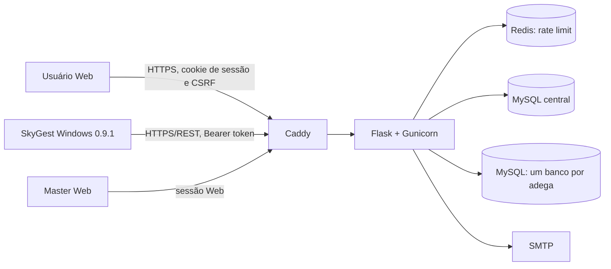
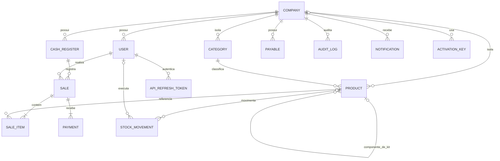
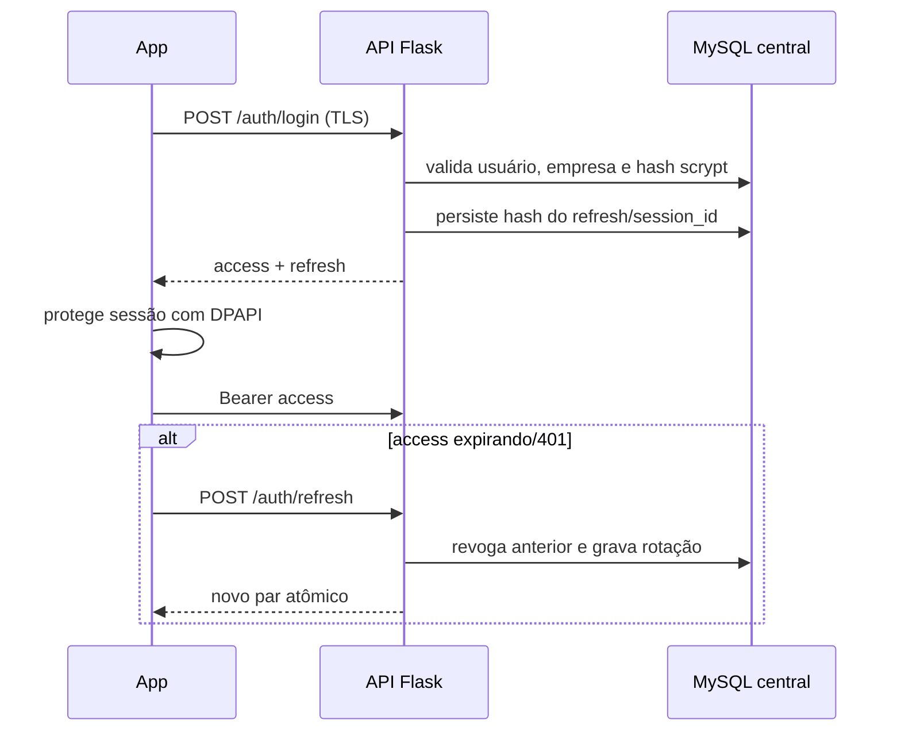
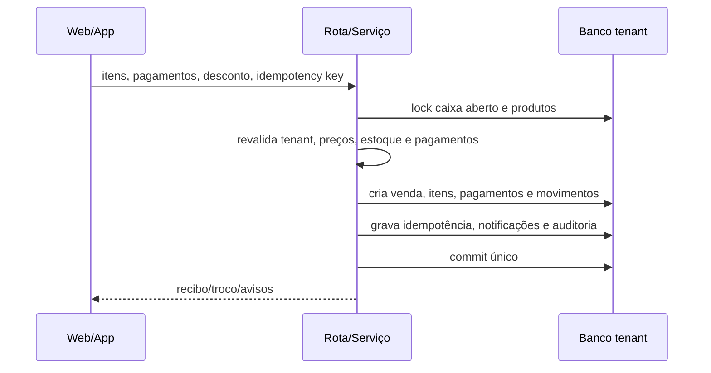
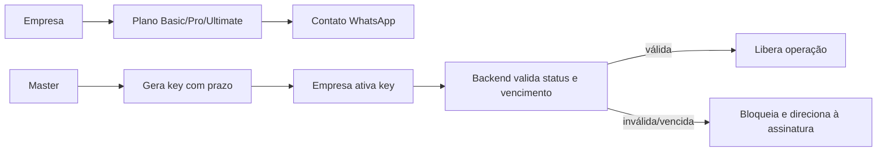

# SkyGest — documentação técnica completa

> Fonte oficial de referência técnica do SaaS. Revisão baseada no código do commit `56397e7`, branch `codex/style-stock-view`, em 29/08/2026. Em caso de divergência, prevalecem o código e as migrations versionadas.

## Índice

1. [Introdução e escopo](#1-introdução-e-escopo)
2. [Visão geral](#2-visão-geral)
3. [Arquitetura](#3-arquitetura)
4. [Tecnologias](#4-tecnologias)
5. [Estrutura do projeto](#5-estrutura-do-projeto)
6. [Funcionalidades](#6-funcionalidades)
7. [Regras de negócio](#7-regras-de-negócio)
8. [Banco de dados](#8-banco-de-dados)
9. [API REST v1](#9-api-rest-v1)
10. [Autenticação](#10-autenticação)
11. [Autorização e permissões](#11-autorização-e-permissões)
12. [Multi-tenancy](#12-multi-tenancy)
13. [Segurança](#13-segurança)
14. [Painel Master](#14-painel-master)
15. [Assinaturas e licenças](#15-assinaturas-e-licenças)
16. [Web, App e Master](#16-web-app-e-master)
17. [Responsividade e acessibilidade](#17-responsividade-e-acessibilidade)
18. [Configuração e variáveis de ambiente](#18-configuração-e-variáveis-de-ambiente)
19. [Instalação local](#19-instalação-local)
20. [Docker e infraestrutura](#20-docker-e-infraestrutura)
21. [Produção e deploy](#21-produção-e-deploy)
22. [CI/CD, releases e instalador](#22-cicd-releases-e-instalador)
23. [Logs, auditoria e observabilidade](#23-logs-auditoria-e-observabilidade)
24. [Tratamento de erros](#24-tratamento-de-erros)
25. [Backup e recuperação](#25-backup-e-recuperação)
26. [Testes](#26-testes)
27. [Performance e concorrência](#27-performance-e-concorrência)
28. [Fluxos importantes](#28-fluxos-importantes)
29. [Dependências](#29-dependências)
30. [Troubleshooting](#30-troubleshooting)
31. [Dívida técnica](#31-dívida-técnica)
32. [Roadmap técnico sugerido](#32-roadmap-técnico-sugerido)
33. [Onboarding de desenvolvedor](#33-onboarding-de-desenvolvedor)
34. [Estados de implementação](#34-estados-de-implementação)
35. [Divergências corrigidas](#35-divergências-corrigidas)
36. [Changelog da documentação](#36-changelog-da-documentação)

## 1. Introdução e escopo

SkyGest é um sistema SaaS de ponto de venda e gestão operacional direcionado principalmente a adegas e pequenos comércios. Centraliza catálogo, estoque, vendas, pagamentos, caixa, contas a pagar, relatórios, equipe, permissões, auditoria, notificações e licenciamento.

Esta revisão analisou os 344 arquivos relevantes do repositório, excluindo caches, ambientes virtuais, builds, artefatos e relatórios gerados. Foram examinados backend, templates, JavaScript, CSS, modelos, serviços, API, migrations, testes, aplicativo WPF, instalador, Docker, scripts OCI e workflows. Os documentos antigos foram usados apenas como contexto; nenhuma afirmação foi considerada verdadeira sem confirmação no código atual.

Convenções:

- **Implementado**: existe caminho executável no código atual.
- **Parcial**: existe infraestrutura, mas faltam etapas para uso completo.
- **Planejado/recomendado**: não existe como recurso disponível.
- **Legado**: mantido apenas para compatibilidade ou histórico.
- “App” significa o cliente nativo Windows WPF; não há aplicativo Android/iOS no repositório.

## 2. Visão geral

O produto possui três interfaces técnicas sobre o mesmo domínio:

- **Web**: Flask/Jinja entrega HTML server-side, CSS e JavaScript vanilla.
- **App Windows**: cliente WPF/.NET 8 online, que consome `/api/v1`.
- **Painel Master**: interface Web exclusiva para administrar o SaaS; não é uma adega operacional. A empresa técnica marcada com `Company.is_system=True` existe para identidade/infraestrutura do Master e deve ser excluída de métricas de clientes.

O backend é a fonte de verdade para autenticação, autorização, cálculo financeiro, estoque, assinatura e isolamento de tenant. O App não conecta ao MySQL e não mantém uma cópia operacional do banco.

Público-alvo atual: adegas e pequenos comércios que precisam operar vendas e estoque com usuários e permissões. Não foram encontrados módulos de clientes, fornecedores, emissão fiscal ou integração com adquirentes.



## 3. Arquitetura

### 3.1 Backend e Web

`app:create_app()` em `app/__init__.py` usa o padrão application factory. Registra os blueprints `auth`, `catalog`, `api_v1` e `main`, inicializa SQLAlchemy, Flask-Login, Flask-Limiter, CSRF, logging e encerramento da sessão tenant. Templates ficam em `app/templates`; estilos e comportamento do navegador em `app/static/css/style.css` e `app/static/js/main.js`.

O HTML é renderizado no servidor. Formulários mutáveis recebem `_csrf_token`; chamadas `fetch` recebem `X-CSRFToken`. O backend também rejeita `Origin` diferente do host para POST/PUT/PATCH/DELETE.

### 3.2 API

A API é um blueprint versionado com prefixo `/api/v1` (`app/routes/api/v1.py`). Respostas de sucesso usam `{"data": ...}`. Erros usam mensagem, código estável, status HTTP e, quando aplicável, campo. Autenticação usa access token assinado e refresh token opaco persistido somente como hash.

### 3.3 Serviços de domínio

- `sale_service.py`: venda/cancelamento, pagamentos, desconto, taxas, lucro, locks, idempotência e estoque.
- `cash_register_service.py`: um caixa aberto, abertura/fechamento e snapshots.
- `stock_service.py`: movimentos, locks, saldo anterior/posterior e notificações.
- `product_service.py` e `category_service.py`: validação e mutações do catálogo.
- `api_auth_service.py`: login, tokens, rotação, revogação e bloqueio de tentativas.
- `notification_service.py` e `alert_service.py`: alertas in-app/e-mail e deduplicação.
- `audit_service.py`: diffs, metadados da requisição e mascaramento.
- `migration_service.py`: heads e upgrade Alembic central/tenant.

### 3.4 Aplicativo Windows

A solução `desktop_wpf/Girofy.Desktop.sln` tem quatro projetos:

- `Girofy.Desktop`: WPF, XAML, views e integração Windows.
- `Girofy.Application`: ViewModels, comandos, modelos e abstrações.
- `Girofy.Infrastructure`: HTTP, logs, preferências, DPAPI e browser externo.
- `Girofy.UnitTests`: testes xUnit.

O nome interno “Girofy” é legado de namespaces, protocolo e diretórios; produto, executável e assets exibidos são SkyGest. O App é `net8.0-windows`, `win-x64`, self-contained e single-file.

### 3.5 Persistência

O banco central contém identidade, empresas, chaves, tokens e administração SaaS. Cada adega possui um banco MySQL próprio, cujo nome é gerado como `<prefixo>_<company_id>_<slug>`. `tenant_session()` resolve a empresa autenticada e abre uma sessão para o engine correto. Empresa e usuários de referência são sincronizados por DML no tenant.

### 3.6 Containers e rede

O Compose oficial possui `mysql`, `redis`, `app`, `backup` e `caddy`. Flask escuta `5003` dentro da rede e é publicado somente em `127.0.0.1:5003`. Caddy publica `18080` por padrão. Redis não publica porta. MySQL persiste em volume; backups persistem em diretório do host.

Não foi encontrada fila dedicada. O “enqueue” de alertas utiliza execução/thread do processo e persistência de estado, não RabbitMQ/Kafka/Celery.

## 4. Tecnologias

| Tecnologia | Versão identificável | Uso |
|---|---:|---|
| Python | 3.13 na imagem/workflows | Backend, scripts, migrations e testes |
| Flask | `>=3,<4` | Web e API |
| Flask-Login | `>=0.6,<0.7` | Sessão Web |
| Flask-SQLAlchemy / SQLAlchemy | `>=3.1,<4` / `>=2,<3` | ORM, sessões, transações e locks |
| Flask-Migrate/Alembic | `>=4.1,<5` | Migrations independentes central/tenant |
| Flask-Limiter | `>=4.1,<5` | Rate limit Web/API com Redis |
| Jinja2 | `>=3.1,<4` | Templates server-side |
| PyMySQL | `>=1.1,<2` | Driver MySQL |
| Gunicorn | `>=22,<24` | Servidor WSGI, 1 worker/4 threads |
| MySQL | 8.4 | Banco central e bancos tenant |
| Redis | 7.4.2 Alpine | Rate limit distribuído, sem persistência |
| Caddy | 2 | Proxy reverso, compressão e terminação conforme endereço configurado |
| HTML/CSS/JavaScript | nativo | Interface Web e responsividade |
| .NET/WPF | .NET 8 | App Windows |
| Microsoft.Extensions.* | 8.0.x | Host, HTTP e logging do App |
| DPAPI/ProtectedData | 8.0.0 | Proteção da sessão local do App |
| xUnit | projeto de testes WPF | Testes do cliente |
| Inno Setup | 6 | Instalador por usuário |
| Docker Compose | Compose v2 esperado | Produção OCI |
| GitHub Actions | workflows YAML | CI, deploy e release preview |

## 5. Estrutura do projeto

```text
/
├── app/                    # Flask, domínio, Web e API
│   ├── models/             # modelos SQLAlchemy
│   ├── routes/             # rotas Web e API v1
│   ├── security/           # CSRF, senhas e rate limit
│   ├── services/           # regras compartilhadas
│   ├── static/             # CSS, JS, marca e modelo XLSX
│   └── templates/          # Jinja Web/Master/e-mails/erros
├── desktop_wpf/            # solução, instalador e testes Windows
├── migrations/central/     # Alembic central, head central_0007
├── migrations/tenant/      # Alembic tenant, head tenant_0008
├── scripts/                # deploy, backup, migrations e OCI
├── deploy/                 # Caddy e inicialização MySQL
├── tests/                  # integração/contrato do backend
├── docs/                   # manuais temáticos e marcos históricos
├── documentacao/           # consolidação histórica em TXT
├── Dockerfile
├── docker-compose.oci.yml
├── config.py
└── requirements.txt
```

Arquivos gerados como `__pycache__`, `.venv*`, `build`, `dist`, `reports`, `logs` e backups não fazem parte do código-fonte e não devem ser versionados.

## 6. Funcionalidades

### 6.1 Login, cadastro e conta

- Login Web por usuário ou e-mail, senha e “lembrar-me”.
- Cadastro Web na própria tela de login usando **somente usuário, e-mail e senha**. O primeiro `Company.name` recebe o usuário; o primeiro usuário é `admin`. O banco tenant é provisionado antes do commit.
- Cliques/reenvios concorrentes não devem duplicar empresa: há desabilitação do submit no navegador, unicidade do usuário e tratamento de `IntegrityError`; cadastro pendente com mesmo usuário/e-mail retoma a verificação.
- Confirmação de e-mail por código com validade, limite de tentativas e reenvio limitado.
- Recuperação de senha por token temporário e troca de e-mail por confirmação.
- Logout Web por POST e logout API com revogação.
- Bloqueio de usuário inativo, empresa inativa e assinatura expirada.

Tabelas principais: `users`, `companies`, `email_verification_codes`, `password_reset_tokens`, `email_change_requests`, `api_refresh_tokens`, `app_registration_codes`. Rotas Web em `app/routes/auth.py`; API em `app/routes/api/v1.py`.

### 6.2 Dashboard

Apresenta vendas, faturamento, ticket, lucro condicionado à permissão, estoque baixo, contas próximas, caixa atual, produtos mais vendidos e movimentação recente. A implementação usa agregações de `dashboard_service.py`; o App consome `/api/v1/dashboard/summary`.

### 6.3 Produtos e categorias

- Listagem paginada, busca por nome/código, status, categoria e ordenação.
- Cadastro/edição responsivos, atualização rápida, ativação/inativação e exclusão protegida.
- Código de barras opcional e único por empresa (`uq_products_company_barcode`).
- Preço de custo/venda, margem, estoque inicial/mínimo e motivo do ajuste.
- Campos de estoque com zero selecionado ao foco, para substituição direta pela primeira digitação.
- Categoria com sugestões ao foco e filtro durante a digitação.
- Kit: pesquisa remota por nome/código, produto-base da mesma empresa e multiplicador positivo.
- Importação CSV/XLSX (limite de upload global 8 MiB por padrão), modelo XLSX e exportação CSV.
- Exclusão é bloqueada quando o produto participa de venda ou é base de kit; nesses casos usa-se inativação.

### 6.4 Estoque

Entradas e ajustes registram tipo, origem, quantidade absoluta, saldo anterior/posterior, custo unitário/total, motivo, observação, usuário e referência. Venda gera saída; cancelamento gera devolução; kit baixa o produto-base multiplicado. Estoque negativo depende de `Company.allow_negative_stock`. Locks `FOR UPDATE` são usados no MySQL para produtos mutados.

Notificações são criadas para estoque negativo, zero, baixo e ajustes manuais grandes. O histórico oferece filtros por texto, produto, categoria, tipo, origem, responsável e datas.

### 6.5 Vendas/PDV

- Caixa aberto obrigatório.
- Pesquisa/autocomplete por nome ou código de barras, mouse/teclado e scanner HID.
- Múltiplos itens com quantidades inteiras positivas.
- Desconto não negativo e não superior ao subtotal.
- Dinheiro, Pix, débito e crédito, inclusive pagamentos mistos.
- Foco automático na pesquisa ao abrir venda; na finalização, foco inicial no dinheiro.
- Atalhos F2/F3 conforme tela e fluxo; navegação por setas mantém o item selecionado visível.
- Cálculo autoritativo com `Decimal`; snapshots de preço/custo/lucro em `sale_items`.
- Taxas configuráveis de Pix/débito/crédito descontadas do lucro.
- Idempotência por `(company_id, idempotency_key)` evita venda/baixa duplicada.
- Cancelamento lógico integral exige motivo/permissão, preserva itens/pagamentos, devolve estoque uma vez e exclui a venda dos indicadores válidos.

Não há cliente associado à venda, orçamento, comanda, pré-venda, cancelamento parcial nem estorno em adquirente.

### 6.6 Caixa

- Um caixa aberto por empresa, protegido por lock no escopo da empresa.
- Abertura com valor inicial e fechamento com conferência exata.
- Total vendido, lucro condicionado à permissão, saldo esperado e formas de pagamento.
- Caixas atuais/anteriores e vendas expansíveis; cancelamentos permanecem visíveis.
- Fechamento divergente informa falta/excesso somente a usuário com permissão financeira.

### 6.7 Contas a pagar

Criação, listagem/pesquisa, categorias, filtros de abertas/pagas/todas, marcar como paga e reabrir. Valores usam `Numeric(12,2)` no modelo. Vencimento alimenta alertas in-app/e-mail.

### 6.8 Relatórios e exportações

Períodos diário, semanal, mensal, anual e personalizado; vendas, faturamento, lucro, desconto, ticket, itens, pagamentos, produtos e horários. Exportações suportadas pelo código: produtos, vendas, caixas e contas a pagar, condicionadas a `can_export_data` ou autorização superior.

### 6.9 Notificações e e-mail

Notificações persistentes possuem categoria, severidade, leitura, descarte, resolução, expiração e deduplicação por empresa. Preferências suportam canais in-app/e-mail/desktop, severidade mínima, horários silenciosos e digest (campos persistidos; digest agendado completo não foi identificado). Alertas SMTP abrangem estoque e vencimentos configurados. `EmailAlertDelivery` evita reenvio contínuo da mesma condição.

### 6.10 Configurações e equipe

Perfil, senha, empresa, operação, taxas financeiras, alertas, backup, importação, exportação, suporte, acessibilidade e equipe. Equipe permite criar/editar usuário, papel, status e permissões dentro da empresa. Hashes e senhas nunca são devolvidos pela API.

### 6.11 Auditoria

Registra ação, entidade, ID, descrição, diffs, ator, papel, empresa, IP, user-agent, request ID, rota, método e data. Exclusões relevantes usam `SET NULL` para preservar o histórico. Há visualização tenant e Master.

## 7. Regras de negócio

| Domínio | Regra implementada |
|---|---|
| Empresa | Usuário não Master opera apenas a própria `company_id`; empresa inativa bloqueia login/operação. |
| Cadastro | Usuário é único; cadastro pendente idêntico retoma verificação; cria empresa e banco tenant atomicamente sempre que possível. |
| Produto | Nome obrigatório; barcode único por empresa; preços/estoques validados; componente do kit pertence ao tenant e não pode ser o próprio kit. |
| Estoque | Toda mutação operacional gera `StockMovement`; negativo só quando permitido; quantidade manual válida e motivo registrado. |
| Venda | Exige caixa aberto, item ativo/do tenant, quantidade positiva, estoque suficiente quando negativo é proibido e pagamento suficiente. |
| Kit | Venda do kit consome `kit_component_quantity × quantidade` do produto-base. |
| Dinheiro | Servidor recalcula subtotal, desconto, total, taxas, pagamento e troco; cliente não define totais finais. |
| Caixa | No máximo um aberto; fechamento só com o caixa que segue aberto e valor igual ao esperado. |
| Cancelamento | Apenas venda concluída, motivo obrigatório, permissão `can_cancel_sales`; restaura estoque e não apaga histórico. |
| Assinatura | Empresa não Master sem validade é redirecionada para assinatura/ativação; Master é isento. |
| Keys | Únicas, ativas, com plano/ciclo/vencimento e vínculo opcional/uso por empresa; cancelamento e renovação são Master. |
| Planos | Basic, Pro e Ultimate são rótulos comerciais/licença; não foram encontrados limites técnicos de recursos por plano. Ultimate é apresentado como mais completo e recebe novas funcionalidades/atualizações. |
| Permissão | Admin/Master têm todas; demais usam flags; ação pode exigir credencial elevada de usuário autorizado da mesma empresa. |

## 8. Banco de dados

### 8.1 Migrations

Existem árvores Alembic independentes:

- Central: `migrations/central`, head `central_0007`.
- Tenant: `migrations/tenant`, head `tenant_0008`.

Desenvolvimento usa `upgrade`; produção usa `verify` no processo Web e o deploy executa `scripts/schema_migrate.py upgrade-all` antes de trocar os serviços. Bancos legados são reconciliados por migrations; downgrades destrutivos de reconciliação são bloqueados.

### 8.2 Tabelas e responsabilidades

| Tabela | Campos/constraints relevantes | Responsabilidade |
|---|---|---|
| `companies` | PK `id`; nome, `database_path`, `active`, `is_system`, plano, renovação, key, taxas, backup | Tenant e configuração empresarial |
| `users` | PK; `username` unique; `company_id`; scrypt; papel/flags | Identidade e autorização |
| `activation_keys` | `key` unique; plano/ciclo/vencimento; empresa atribuída/usada | Licenciamento |
| `api_refresh_tokens` | `session_id` unique/index; hashes; validade/revogação | Sessões do App |
| `app_registration_codes` | hashes, PKCE, validade/uso | Handoff de cadastro Web→App |
| `email_verification_codes` | hash, validade, tentativas/uso | Confirmação de e-mail |
| `password_reset_tokens` | hash, validade/uso | Recuperação de senha |
| `email_change_requests` | e-mails, token hash, validade/uso | Troca de e-mail |
| `categories` | `company_id`, nome | Classificação por tenant |
| `products` | barcode único por empresa; categoria; preços; estoque; autorrelação kit | Catálogo |
| `cash_registers` | abertura/fechamento/status, usuário/empresa | Sessões de caixa |
| `sales` | totais, status/cancelamento, usuário, empresa e caixa | Cabeçalho da venda |
| `sale_items` | produto, quantidade, snapshots de preço/custo/lucro | Itens históricos |
| `payments` | venda, método, valor | Pagamentos da venda |
| `api_sale_requests` | unique empresa+idempotency key | Antiduplicação de venda API |
| `stock_movements` | empresa/produto/usuário, tipo/origem, antes/depois/custo | Livro de estoque |
| `payables` | `Numeric(12,2)`, vencimento, pago/data | Contas a pagar |
| `audit_logs` | ator, ação, entidade, diffs, contexto HTTP | Auditoria |
| `notifications` | unique empresa+dedup key; ciclo de vida/canais | Alertas persistentes |
| `notification_preferences` | unique empresa+usuário+tipo | Preferências de alertas |
| `email_alert_settings` | empresa+tipo, habilitado/destinatários | Regras SMTP |
| `email_alert_deliveries` | empresa, tipo/chave, destinatários/data | Deduplicação de entrega |

### 8.3 Relacionamentos principais



Não existe exclusão lógica uniforme. Vendas usam status/cancelamento lógico; produtos podem ser inativados; outras exclusões são físicas e protegidas por regras/FKs.

## 9. API REST v1

### 9.1 Convenções

- Base: `/api/v1`.
- `Content-Type: application/json` nas mutações JSON; multipart na importação.
- Autenticação: `Authorization: Bearer <access_token>`, salvo health/login/refresh/recuperação/exchange/ativação conforme fluxo.
- Paginação usa `page`/`per_page` nos recursos listáveis.
- Datas civis: `YYYY-MM-DD`; timestamps: ISO 8601.
- Erros comuns: `400` JSON/argumento inválido, `401` token/credencial, `403` permissão, `404` recurso, `409` conflito, `422` regra/validação, `429` rate limit, `503` dependência.

### 9.2 Endpoints

| Método e rota | Objetivo e entrada principal | Autenticação/permissão |
|---|---|---|
| `GET /health` | disponibilidade básica | pública |
| `GET /health/dependencies` | estado seguro de DB/Redis | pública |
| `POST /auth/login` | `identifier`, `password`; retorna identidade/tokens | pública, limitada, HTTPS exigido em produção |
| `POST /auth/registration-callback/exchange` | code/state/verifier PKCE | pública, limitada |
| `POST /auth/password-recovery/request` | identificador | pública, resposta não enumerável |
| `POST /subscription/activate` | credencial/key de ativação | limitada; fluxo de licença |
| `POST /auth/refresh` | refresh token; rotação | pública autenticada pelo token, limitada |
| `POST /auth/logout` | revoga sessão | Bearer |
| `GET /auth/me` | identidade, empresa e permissões | Bearer |
| `GET /settings/account` | snapshot da conta/configurações | Bearer |
| `PUT /settings/company` | nome/operação/taxas permitidas | `can_manage_settings` |
| `PUT /settings/profile` | dados pessoais | Bearer |
| `PUT /settings/password` | senha atual/nova | Bearer |
| `PUT /settings/backup` | frequência | admin/configurações |
| `POST /settings/backup/run` | backup manual | admin, rate limit |
| `GET /settings/export/{type}` | CSV de products/sales/cash/payables | `can_export_data` |
| `POST /settings/import/products` | CSV/XLSX multipart | `can_manage_products`, rate limit |
| `GET /settings/team` | integrantes | administração da equipe |
| `POST /settings/team` | cria funcionário e permissões | admin/configurações |
| `PUT /settings/team/{id}` | atualiza funcionário | admin/configurações, mesmo tenant |
| `GET /dashboard/summary` | métricas operacionais | Bearer/permissões refletidas |
| `GET /reports/summary` | período e agregados | `can_view_reports` |
| `GET /reports/products` | relatório paginado por produto | `can_view_reports` |
| `GET /audit/logs` | filtros/paginação | `can_view_audit_logs` |
| `GET /payables` | q/status/category/datas/página | `can_manage_payables` |
| `GET /payables/categories` | categorias conhecidas | `can_manage_payables` |
| `POST /payables` | descrição, categoria, valor, vencimento, notas | `can_manage_payables` |
| `POST /payables/{id}/pay` | marca paga | `can_manage_payables` |
| `POST /payables/{id}/reopen` | reabre | `can_manage_payables` |
| `GET /cash-registers/summary` | caixa atual/recentes | `can_manage_cash_register` |
| `GET /cash-registers/{id}` | detalhe e timeline | `can_manage_cash_register` |
| `POST /cash-registers/open` | opening_amount | `can_manage_cash_register` |
| `POST /cash-registers/close` | id e closing_amount | `can_manage_cash_register` |
| `POST /sales` | items, payments, discount, idempotency key | `can_manage_sales` |
| `GET /sales/{id}` | recibo do tenant | `can_manage_sales` |
| `POST /sales/{id}/cancel` | motivo | `can_cancel_sales` |
| `GET /sales/today` | histórico/filtros/paginação | `can_manage_sales` |
| `GET /catalog/categories` | categorias/pesquisa | catálogo |
| `POST /catalog/categories` | nome | `can_manage_categories` |
| `PUT /catalog/categories/{id}` | nome | `can_manage_categories` |
| `DELETE /catalog/categories/{id}` | exclusão protegida | `can_manage_categories` |
| `GET /catalog/products` | q/barcode/categoria/status/preço/ordem/página | `can_view_products` |
| `POST /catalog/products` | produto completo | `can_manage_products` |
| `PUT /catalog/products/{id}` | produto completo | `can_manage_products` |
| `DELETE /catalog/products/{id}` | exclusão protegida | `can_manage_products` |
| `GET /stock/movements` | filtros/paginação | `can_view_stock_movements` |
| `POST /stock/entries` | produto, quantidade, custo/motivo | `can_manage_stock` |
| `POST /stock/adjustments` | produto, saldo/ajuste, motivo | `can_manage_stock` |
| `GET /notifications/email-alert-settings` | regras SMTP | configurações |
| `PUT /notifications/email-alert-settings` | regras/destinatários | configurações |
| `POST /notifications/email-alert-settings/test` | envio de teste | configurações |
| `GET /notifications` | filtros/paginação | Bearer |
| `GET /notifications/unread-count` | contador | Bearer |
| `PUT /notifications/{id}/read` | marca lida | dono/tenant |
| `PUT /notifications/read-all` | marca todas | Bearer |
| `PUT /notifications/{id}/dismiss` | descarta | dono/tenant |
| `GET /notifications/preferences` | preferências | Bearer |
| `PUT /notifications/preferences` | canais/severidade/horários | Bearer |

O contrato exato de campos e serializadores está em `app/routes/api/v1.py` e nos modelos C# em `desktop_wpf/src/Girofy.Application/Models`. Novos clientes devem tolerar campos adicionais e usar os códigos de erro, não textos localizados.

### 9.3 Rotas Web relevantes

Web usa `/login`, `/verify-email`, `/forgot-password`, `/reset-password/<token>`, `/assinaturas`, `/dashboard`, `/catalogo/produtos`, `/catalogo/categorias`, `/vendas`, `/vendas/nova`, `/caixa`, `/estoque/*`, `/contas-a-pagar`, `/relatorios`, `/auditoria`, `/configuracoes` e `/exportacoes/<type>`. O Master usa `/master`, `/master/adegas`, `/master/usuarios`, `/master/assinaturas`, `/master/logs` e `/master/auditoria`, com POSTs específicos para keys, renovação, acesso, status e exclusão.

## 10. Autenticação

### 10.1 Web

Flask-Login mantém cookie de sessão HTTPOnly, SameSite configurável e Secure em produção. Sessão permanente dura 8 horas por padrão. Senhas usam `werkzeug.security.generate_password_hash(..., method="scrypt")`. Login bem-sucedido é auditado; mensagens tratam usuário/empresa inativos e e-mail pendente.

### 10.2 App/API

Access token assinado tem 15 minutos por padrão. Refresh token tem 30 dias, é aleatório, armazenado no servidor apenas por SHA-256 e rotacionado a cada uso. Registro guarda session ID, hash vinculado às credenciais, IP, user-agent, validade, revogação e substituição. Mudança de senha invalida o vínculo. O App protege a sessão em `%LocalAppData%` com DPAPI `CurrentUser` e faz escrita atômica.



### 10.3 Recuperação/cadastro no App

Recuperação solicita e-mail pelo backend. O cadastro principal ocorre na Web; o callback `girofy://` e o exchange PKCE permitem devolver a sessão ao App sem colocar senha na URI.

## 11. Autorização e permissões

Papéis: `master`, `admin`, `manager` e `operator`. Master/Admin passam em todas as permissões; demais usam flags. `can_view_products` é sempre permitido a usuário ativo e gestão implica visualização.

Permissões persistidas: visualizar/gerenciar produtos, categorias, vendas, cancelar vendas, caixa, relatórios, contas, configurações, estoque/movimentos e auditoria. `can_view_finance` e `can_export_data` são regras administrativas derivadas. A Web oferece override pontual com credencial de usuário autorizado da mesma empresa; a API rejeita sem permissão do token.

## 12. Multi-tenancy

1. O login resolve `User.company_id` no banco central.
2. `current_tenant_company()` usa a empresa do usuário; Master só acessa tenant após selecionar `session['master_company_id']`.
3. `tenant_engine()` valida nome do banco, cria/migra quando permitido e guarda engine em cache.
4. `tenant_session()` fornece sessão operacional específica.
5. Consultas e IDs ainda são filtrados por `company_id`.
6. Serviços revalidam produto, categoria, venda, caixa e usuário dentro do tenant.

Proteções existentes: banco físico por adega, filtros `company_id`, FKs, validação de IDs, permissões server-side e idempotência escopada por empresa. Risco residual: os bancos tenant replicam referências de empresa/usuário e usam a mesma metadata ampla; qualquer rota nova que use `db.session` no lugar de `tenant_session()` sem filtro pode quebrar o isolamento. Revisão de tenant deve ser obrigatória em code review.

## 13. Segurança

### 13.1 Controles implementados

- scrypt para senhas; tokens/keys sensíveis mascarados em auditoria/logs.
- CSRF por token em Web e verificação de origem em métodos mutáveis.
- ORM/queries parametrizadas; identificadores de banco passam por allowlist alfanumérica/underscore.
- Cookies HTTPOnly/SameSite/Secure em produção e HSTS quando Secure.
- CSP, `nosniff`, `SAMEORIGIN`, Referrer/Permissions/COOP/CORP headers.
- Access token curto, refresh com hash/rotação/revogação e transporte seguro obrigatório.
- Rate limit Redis distribuído; produção recusa `memory://` e fallback.
- Respostas 429/503 não armazenáveis e logs de segurança com request ID.
- Upload limitado; CSV/XLSX parseado pelo backend sem executar macros.
- MySQL/Flask não expostos diretamente na interface pública do Compose.
- Backup pré-migration obrigatório e health checks pós-deploy.

### 13.2 Pontos de atenção

Não foram identificados segredos reais versionados nos arquivos examinados; exemplos usam placeholders. Não copie `.env`, `.env.save`, chaves OCI/SSH ou arquivos de backup para commits.

| Severidade | Quantidade | Achado |
|---|---:|---|
| Crítico | 0 | Nenhum problema crítico confirmado apenas pelo código. |
| Alto | 1 | `desktop_wpf/.../appsettings.json` aponta para IP HTTP e `AllowInsecureHttp=true`; uma build distribuída com essa configuração permite credenciais/tokens sem TLS. Produção deve usar `https://skygest.com.br` e falso. |
| Médio | 4 | CSP permite `'unsafe-inline'`; não há restauração/off-site criptografado comprovados; vários campos financeiros legados ainda são `Float`; isolamento depende de disciplina nas rotas novas apesar do banco por tenant. |
| Baixo | 3 | Namespaces/protocolo/diretórios “Girofy” permanecem; actions exibem aviso de runtime Node antigo; ausência de cobertura E2E/browser visual automatizada. |

Recomendações: bloquear build comercial se BaseUrl não for HTTPS; migrar floats financeiros por migration planejada; adotar nonce/hash CSP; testar restauração/off-site; criar testes automatizados de isolamento para toda rota nova; atualizar actions quando versões compatíveis forem disponíveis.

## 14. Painel Master

O Master é administração global, não tenant comercial. Recursos:

- dashboard com métricas globais excluindo `is_system`;
- lista de adegas simplificada/expansível, estatísticas e edição;
- ativar/inativar, acessar para suporte e sair do acesso;
- exclusão protegida de empresa e banco tenant;
- usuários globais e exclusão protegida;
- assinaturas, geração/edição/renovação/cancelamento de keys e limpeza de histórico;
- logs técnicos e limpeza;
- auditoria Master.

As rotas verificam `current_user.role == 'master'`; usuário comum não deve conseguir selecionar outro tenant. Operações destrutivas exigem confirmação e são auditadas quando implementado no fluxo correspondente.

## 15. Assinaturas e licenças

Planos comerciais atuais:

| Plano | Preço mensal exibido | Estado |
|---|---:|---|
| Basic | R$ 50,00 | Implementado como rótulo/licença; sem limites técnicos específicos encontrados |
| Pro | R$ 120,00 | Implementado como rótulo/licença; inclui comercialmente o Basic |
| Ultimate | R$ 180,00 | “Mais completo”; inclui Pro e todas as novas funcionalidades/atualizações |

O botão **Assinar** abre WhatsApp com mensagem específica por plano e número configurável por `SUBSCRIPTION_WHATSAPP_NUMBER`. Não há gateway de cobrança, webhook, fatura ou renovação automática financeira.

Keys guardam plano, nome, ciclo (`monthly`, `quarterly`, `semiannual`, `annual`, `custom`), vencimento, status, empresa atribuída/usada, criador e datas. O Master gera e administra; a empresa ativa uma key válida. `Company.subscription_valid`/helpers determinam acesso. Nomes legados Essencial/Profissional/Premium são normalizados pelas migrations para Basic/Ultimate, mas não são opções novas.

**Limitação importante:** o código não aplica cotas de usuários/produtos/vendas nem feature flags por Basic/Pro/Ultimate. A diferenciação atual é comercial e de licenciamento, não de capacidades técnicas.

## 16. Web, App e Master

| Funcionalidade | Web | App Windows | Master |
|---|:---:|:---:|:---:|
| Login/logout/recuperação | ✅ | ✅ | ✅ Web |
| Cadastro inicial | ✅ | ↗️ abre/retoma Web | ❌ |
| Dashboard operacional | ✅ | ✅ | ❌ |
| Produtos/categorias/kits | ✅ | ✅ | via acesso assistido |
| Vendas/pagamentos/cancelamento | ✅ | ✅ | via acesso assistido |
| Caixa | ✅ | ✅ | via acesso assistido |
| Estoque | ✅ | ✅ | via acesso assistido |
| Contas a pagar | ✅ | ✅ | via acesso assistido |
| Relatórios | ✅ | ✅ | via acesso assistido |
| Auditoria tenant | ✅ | ✅ | ✅ global |
| Notificações/preferências | ✅ | ✅ | parcial/global |
| Equipe/configurações | ✅ | ✅ | usuários globais |
| Importação/exportação/backup | ✅ | ✅ via API | administração indireta |
| Gestão de adegas | ❌ | ❌ | ✅ |
| Gestão de keys/assinaturas | consulta/ativação | ativação | ✅ |
| Cobrança automática | ❌ | ❌ | ❌ |
| Clientes/fornecedores/fiscal | ❌ | ❌ | ❌ |

Diferenças: Web usa cookie/CSRF e renderização server-side; App usa Bearer/refresh/DPAPI e UX XAML. Master é exclusivamente Web. Regras críticas convergem nos serviços, mas algumas rotas Web ainda possuem adaptação própria de formulário/flash.

## 17. Responsividade e acessibilidade

Web usa grid/flex, tabelas com wrappers, painéis expansíveis e menu colapsável. `style.css` contém breakpoints reais em 1500, 1480, 1280, 1200/1180, 1080, 980/960, 900, 820/780/768, 640, 575/560/520 px e ajustes por altura (por exemplo 760 px). Em telas pequenas, grids viram coluna, botões podem ocupar largura total, sidebar torna-se móvel e tabelas usam scroll/representação compacta.

Produtos e painel Master possuem regras específicas de proporção. Modais e formulários de venda/cadastro foram ajustados para desktop e celular. Tema Light/Dark, tamanho de texto, contraste, negrito e `prefers-reduced-motion` são persistidos no `localStorage`.

O WPF usa recursos dinâmicos, layouts responsivos à janela, virtualização, scroll e acessibilidade Windows. Homologação visual em Windows real, DPI 100/125/150% e resoluções mínimas continua necessária; CI valida estrutura/build, não aparência.

## 18. Configuração e variáveis de ambiente

Nunca documente valores reais. Exemplos seguros:

| Variável | Obrigatória em produção | Finalidade/exemplo seguro |
|---|:---:|---|
| `APP_ENV` | ✅ | `production`/`development` |
| `SECRET_KEY` | ✅ | assinatura de sessão; `<segredo-longo>` |
| `API_TOKEN_SECRET` | recomendada | segredo distinto para access token |
| `BUSINESS_TIMEZONE` | não | `America/Sao_Paulo` |
| `SCHEMA_MANAGEMENT_MODE` | ✅ | produção `verify`; dev `upgrade` |
| `FLASK_DEBUG` | ✅ | produção `0` |
| `MASTER_DEFAULT_USERNAME` | ✅ | login bootstrap Master |
| `MASTER_DEFAULT_PASSWORD` | ✅ | `<senha-forte>`; default recusado em produção |
| `PASSWORD_MIN_LENGTH`/`MAX_LENGTH` | não | `8`/`128` |
| `CSRF_ENABLED` | ✅ | `1` |
| `SESSION_LIFETIME_HOURS` | não | `8` |
| `SESSION_COOKIE_SECURE` | ✅ com HTTPS | `1` |
| `SESSION_COOKIE_SAMESITE` | não | `Lax` |
| `MAX_CONTENT_LENGTH` | não | `8388608` |
| `API_ACCESS_TOKEN_MINUTES` | não | `15` |
| `API_REFRESH_TOKEN_DAYS` | não | `30` |
| `API_LOGIN_ATTEMPT_LIMIT` | não | `5` |
| `API_LOGIN_BLOCK_SECONDS` | não | `900` |
| `API_ALLOW_INSECURE_AUTH` | ✅ | produção `0` |
| `TRUST_PROXY_HEADERS` | ✅ atrás do Caddy | `1` |
| `TRUSTED_PROXY_COUNT` | ✅ | `1` para Compose atual |
| `RATELIMIT_ENABLED` | ✅ | `1` |
| `RATELIMIT_STORAGE_URI` | ✅ | `redis://redis:6379/0` |
| `RATELIMIT_IN_MEMORY_FALLBACK_ENABLED` | ✅ | produção `0` |
| `RATELIMIT_KEY_PREFIX` | não | `girofy` (legado interno) |
| `RATELIMIT_LOGIN` | não | `10 per 5 minutes` |
| `RATELIMIT_PASSWORD_RESET` | não | `3 per 15 minutes` |
| `RATELIMIT_EMAIL_RESEND` | não | `3 per 15 minutes` |
| `RATELIMIT_REGISTRATION` | não | `3 per hour` |
| `RATELIMIT_ACTIVATION` | não | `5 per 15 minutes` |
| `RATELIMIT_REFRESH` | não | `120 per hour` |
| `RATELIMIT_API_GENERAL` | não | `600 per minute` |
| `RATELIMIT_IMPORT/BACKUP/EXPORT/ADMIN` | não | limites por operação |
| `SUBSCRIPTION_WHATSAPP_NUMBER` | não | número E.164 sem símbolos |
| `MYSQL_USER/PASSWORD/HOST/PORT/DATABASE` | ✅ | conexão central, senha mascarada |
| `DATABASE_URL` | opcional | substitui campos MySQL; nunca versionar credenciais |
| `MYSQL_TENANT_DATABASE_PREFIX` | não | `adega` |
| `MYSQL_TENANT_DATABASE_URL_TEMPLATE` | opcional | template `{database}` |
| `MYSQL_SERVER_DATABASE_URL` | ✅ para provisionar | conexão administrativa mascarada |
| `MYSQL_ROOT_PASSWORD` | ✅ Compose | `<senha-root-forte>` |
| `PUBLIC_BASE_URL` | produção | `https://skygest.com.br` |
| `MAIL_SMTP_SERVER/PORT/LOGIN/PASSWORD` | se e-mail ativo | SMTP; password secreto |
| `MAIL_FROM_EMAIL/NAME` | se e-mail ativo | remetente SkyGest |
| `MAIL_SUPPRESS_SEND` | testes | `1` em testes |
| `PORT` | não | Flask local `5001`; container sobrescreve `5003` |
| `GIROFY_SITE_ADDRESS` | Compose | domínio/endereço do Caddy |
| `GIROFY_PUBLIC_HTTP_PORT` | não | `18080` |
| `AUTO_BACKUP_ENABLED/INTERVAL_SECONDS` | não | `1`/`86400` |
| `AUTO_BACKUP_RETENTION_DAYS/COUNT` | não | `30`/`30` |
| `GIROFY_BACKUP_HOST_DIR/UID/GID` | Compose | volume/permissões de backup |
| `AUTO_AUDIT_CLEANUP_ENABLED` | não | `1` |
| `AUTO_AUDIT_CLEANUP_INTERVAL_SECONDS` | não | `259200` |
| `AUTO_AUDIT_RETENTION_DAYS` | não | `90` |
| `OCI_*` | somente provisionamento | região, shape, rede e caminhos; OCIDs/chaves são secretos |

`config.py` também aceita aliases antigos Gmail/Brevo para SMTP. Eles são compatibilidade, não integrações separadas comprovadas.

## 19. Instalação local

### 19.1 Web/backend

Pré-requisitos: Python 3.13, MySQL 8 compatível e, para simular produção, Redis/Docker.

```bash
git clone <repositorio>
cd pdv-adega-jf
python3.13 -m venv .venv
source .venv/bin/activate
python -m pip install -r requirements.txt
cp .env.example .env
# edite .env sem versionar segredos
python scripts/schema_migrate.py upgrade-all
python app.py
```

Acesse `http://127.0.0.1:5001/login` conforme o `PORT`. O bootstrap cria a conta Master a partir das variáveis somente quando necessário. Em produção, defaults inseguros impedem inicialização.

### 19.2 Testes backend

```bash
TESTING=1 MAIL_SUPPRESS_SEND=1 python -m unittest discover
python scripts/schema_migrate.py --help
```

### 19.3 App Windows

Em Windows com SDK .NET 8:

```powershell
dotnet restore desktop_wpf/Girofy.Desktop.sln
dotnet test desktop_wpf/tests/Girofy.UnitTests/Girofy.UnitTests.csproj -c Release
dotnet run --project desktop_wpf/src/Girofy.Desktop/Girofy.Desktop.csproj
```

Configure `desktop_wpf/src/Girofy.Desktop/appsettings.json` para uma URL HTTPS antes de distribuição.

## 20. Docker e infraestrutura

```bash
docker compose -f docker-compose.oci.yml up -d
docker compose -f docker-compose.oci.yml ps
docker compose -f docker-compose.oci.yml logs --tail=200 app caddy mysql redis backup
docker compose -f docker-compose.oci.yml down
```

| Serviço | Porta/volume | Observação |
|---|---|---|
| MySQL 8.4 | somente rede; `girofy_mysql_data` | utf8mb4, health check |
| Redis 7.4.2 | somente rede; tmpfs | 96 MiB, allkeys-lru, read-only, sem persistência |
| App | `127.0.0.1:5003` | Gunicorn 1 worker/4 threads, backups/logs/reports montados |
| Backup | `/backups` host | mysqldump completo e limpeza de auditoria |
| Caddy 2 | host `18080` padrão | reverse proxy para `app:5003`, gzip |

O Compose aplica `restart: unless-stopped`. Backup/Redis removem capabilities e usam `no-new-privileges`; Redis e backup são read-only (com tmpfs para Redis).

## 21. Produção e deploy

Fluxo real:

```mermaid
flowchart LR
    D[Commit] --> G[Push main]
    G --> T[GitHub Actions: 242 testes + migrations/scripts]
    T --> R[Runner self-hosted OCI]
    R --> B[rsync preservando .env/dados]
    B --> I[Build app/backup]
    I --> DB[Subir MySQL/Redis]
    DB --> BK[Backup obrigatório]
    BK --> MG[upgrade-all central/tenants]
    MG --> UP[Atualizar app/backup/Caddy]
    UP --> H[Health: login, DB e Redis]
```



Workflow padrão: `.github/workflows/deploy-oci-self-hosted.yml`, disparado por push em `main`, exceto alterações somente `docs/**`/`*.md`, ou manualmente. Runner: `self-hosted`, `linux`, `girofy-oci`; caminho padrão `/opt/girofy/app`.

`scripts/deploy_self_hosted_app.sh` usa `rsync --delete`, exclui `.env`, Git, venvs, caches, logs, backups, reports, database, build e dist; builda; faz dump completo obrigatório; migra; sobe serviços; valida `/login`, `/health/dependencies` e `/api/v1/health/dependencies`.

Fallback manual/SSH: `.github/workflows/deploy-oci.yml` e `scripts/deploy_oci_app.sh`. Rollback seguro requer parar escritas, restaurar o dump pré-deploy e publicar commit anterior; não existe botão de rollback nem downgrade destrutivo automático.

O domínio público observado no processo operacional é `https://skygest.com.br`; Caddy recebe o endereço real via ambiente. Não há configuração DNS/certificado versionada suficiente para documentar o provedor ou gestão externa do DNS.

## 22. CI/CD, releases e instalador

### 22.1 Web

O workflow de deploy instala Python 3.13, dependências, executa `python -m unittest discover`, valida heads (`central_0007`, `tenant_0008`) e sintaxe dos scripts. Só depois libera a OCI.

### 22.2 Windows preview

`.github/workflows/build-windows-wpf.yml` roda em `windows-latest` quando `desktop_wpf` ou contratos relacionados mudam, além de execução manual/PR. Etapas:

1. validar versão e regras XAML;
2. instalar .NET 8/Python 3.13;
3. executar contratos backend (uma repetição em falha isolada);
4. restore e testes xUnit;
5. publish `win-x64`, self-contained, single-file;
6. smoke test de inicialização;
7. instalar Inno Setup 6, criar/testar instalador;
8. publicar artefatos por 7 dias;
9. substituir assets da release prerelease `windows-preview`.

Versão atual: `0.9.1`, assembly/file `0.9.1.0`, informational `0.9.1-preview`. Artefatos: `SkyGest.exe` e `SkyGest-Setup-0.9.1.exe`. Instalação por usuário em `%LocalAppData%\Programs\SkyGest`, sem elevação. Code Signing e atualização automática não foram encontrados.

O protocolo `girofy://` é legado intencional para callback. Upgrade remove executável/atalhos Girofy antigos e preserva dados locais.

## 23. Logs, auditoria e observabilidade

Backend configura logs em `logs/`, incluindo erros e eventos de segurança, com request ID e mascaramento. Containers persistem `girofy_logs`; diagnóstico usa `docker compose logs`. Erros 500 exibem request ID ao usuário sem stack trace.

O App usa `LocalFileLoggerProvider` e mantém logs sob o caminho legado `%LocalAppData%\Girofy\logs`. Tokens e cabeçalhos Authorization não devem ser registrados. Exceções de UI/tarefa possuem handlers globais.

`audit_logs` é trilha funcional, não substitui log técnico. Limpeza automática remove auditoria anterior a 90 dias por padrão em central/tenants. Health checks expõem somente estados de database/Redis, sem credenciais.

Não foram encontrados APM, OpenTelemetry, Prometheus, tracing distribuído ou agregador externo.

## 24. Tratamento de erros

- Web usa flash, validações de campo e páginas 400/404/429/500/503.
- API usa envelope estável e `SaleOperationError`, `CashRegisterOperationError`, `ProductOperationError` e validações auxiliares.
- Transações fazem rollback em exceção; fechamento de sessão tenant ocorre no teardown.
- Rate limit indisponível falha fechado em produção com 503.
- App converte HTTP/timeout/contrato em `GirofyApiException`, mensagens de ViewModel e ações de retry; refresh concorrente é coordenado.
- Banco/migration com schema atrasado impede startup/deploy em `verify`.

Inconsistência: rotas Web históricas ainda possuem validações próprias além dos serviços compartilhados. Mudanças de regra devem priorizar serviços e testes de paridade.

## 25. Backup e recuperação

Implementado:

- container `backup` executa `mysqldump --all-databases`, single transaction, routines/events/triggers/hex-blob;
- arquivo temporário é validado, renomeado atomicamente e recebe modo `600`;
- periodicidade padrão diária; retenção 30 dias/30 cópias;
- volume host padrão `/opt/girofy/backups`;
- backup obrigatório antes de migrations;
- backup manual por configurações/API e metadados em `Company`.

Parcial/não comprovado:

- não há restauração guiada na interface;
- não há teste automatizado periódico de restore;
- não há replicação off-site, criptografia própria dos dumps ou política formal de desastre no código.

Procedimento de emergência deve ser ensaiado: parar escrita, copiar dump para ambiente seguro, restaurar com cliente MySQL, verificar heads, executar health/tests e documentar RPO/RTO.

## 26. Testes

Backend: `tests/test_routes.py` cobre Web/API, autenticação, tenant, permissões, vendas, caixa, estoque, catálogo, relatórios, Master, assinatura, segurança e rate limit; `tests/test_migrations.py` cobre árvores/reconciliação. A suíte atual contém 242 testes aprovados no último deploy do commit anterior e é executada integralmente a cada deploy.

App: testes xUnit de ViewModels, sessão/refresh, catálogo, vendas, caixa, estoque, contas, relatórios, auditoria, notificações, acessibilidade, formatação monetária/data, scanner e behaviors. CI também compila, inicia o executável e testa instalar/desinstalar.

Lacunas: ausência de percentual de cobertura publicado; E2E browser completo; testes visuais/snapshots; carga/soak; concorrência distribuída com múltiplas instâncias; restore real; homologação manual de DPI/periféricos.

## 27. Performance e concorrência

Controles existentes: paginação de produtos/API/estoque/auditoria, eager loading seletivo, agregações SQL, virtualização WPF, debounce/cancelamento de busca, cache de detalhes, idempotência de venda, `FOR UPDATE` e lock por empresa/caixa. Engines tenant e sincronização de referência têm cache/lock; sync é limitado a 300 s.

Pontos de atenção: um worker Gunicorn com quatro threads limita escala; criação de engine por tenant cresce com número de empresas e não possui política explícita de expiração; contexto Web pode calcular notificações/alertas em requisições; relatórios/agregações crescerão com volume; índices devem acompanhar filtros; floats financeiros legados podem causar arredondamento apesar de `Decimal` nos serviços.

Recomenda-se medir antes de otimizar: slow query log, EXPLAIN, latência p95/p99, cardinalidade por tenant e tamanho de auditoria/notificações.

## 28. Fluxos importantes

### 28.1 Venda



### 28.2 Cancelamento

Usuário autorizado informa motivo → backend bloqueia/revalida venda → marca `cancelled` → devolve exatamente o estoque registrado (incluindo kit) → mantém itens/pagamentos → audita → indicadores usam `Sale.valid_filter()`.

### 28.3 Assinatura



## 29. Dependências

Dependências Python diretas estão em `requirements.txt`, com faixas amplas e sem lock/hashes. Dependências .NET usam versões fixas nos `.csproj`. Imagens Docker fixam MySQL 8.4 e Redis 7.4.2, mas Caddy usa tag major `2` e Python base `3.13-slim` mutável.

Pontos recomendados: gerar lock/SBOM e rotina de atualização; fixar digest de imagens críticas; executar scanner de dependências/imagem. Nenhuma dependência foi removida nesta auditoria. Não foi possível afirmar vulnerabilidades concretas sem consulta a banco CVE no instante da build.

## 30. Troubleshooting

### Aplicação não inicia

```bash
docker compose -f docker-compose.oci.yml ps
docker compose -f docker-compose.oci.yml logs --tail=200 app
curl -i http://127.0.0.1:18080/health/dependencies
```

Verifique `.env`, defaults recusados, Redis obrigatório e schema em head.

### Banco/migration

```bash
python scripts/schema_migrate.py central-current
python scripts/schema_migrate.py tenants-status
python scripts/schema_migrate.py upgrade-all
```

Não rode downgrade destrutivo. Confirme backup antes de upgrade.

### Container/Redis/MySQL

```bash
docker compose -f docker-compose.oci.yml logs --tail=200 mysql redis
docker compose -f docker-compose.oci.yml exec mysql mysqladmin ping -uroot -p
docker compose -f docker-compose.oci.yml exec redis redis-cli ping
```

### HTTP 429/503

Leia `Retry-After`; 429 indica limite. 503 de rate limit pode indicar Redis indisponível. Não desative proteção em produção.

### App não conecta

Confirme URL HTTPS, relógio do Windows, `/api/v1/health/dependencies`, proxy/certificado e logs `%LocalAppData%\Girofy\logs`. `AllowInsecureHttp` deve ser falso em release comercial.

### Login/cadastro

Confirme e-mail verificado, usuário/empresa ativos e assinatura. Cadastro repetido pendente deve continuar em `/verify-email`, não criar nova empresa.

### Deploy falhou

Abra o job, identifique teste/backup/migration/health. A versão anterior permanece quando backup/migration falha antes da atualização. Não apague `.env`/backups para “corrigir”.

## 31. Dívida técnica

### Prioridade alta

1. Remover HTTP/insecure do `appsettings.json` de distribuição e impor HTTPS em build/release.
2. Criar teste e procedimento formal de restauração/off-site, com RPO/RTO.
3. Ampliar testes de isolamento tenant e concorrência com MySQL real.

### Prioridade média

1. Migrar dinheiro legado de `Float` para `Numeric/Decimal` com plano de compatibilidade.
2. Reduzir `'unsafe-inline'` da CSP.
3. Consolidar validações Web/API nos serviços compartilhados.
4. Definir ciclo de vida/limite do cache de engines tenant.
5. Introduzir lock de dependências, SBOM e scanning.
6. Instrumentar métricas/latência e slow queries.

### Prioridade baixa

1. Concluir renomeação interna Girofy sem quebrar upgrade/protocolo.
2. Atualizar actions que geram aviso de Node runtime.
3. Automatizar testes visuais e documentação de screenshots.
4. Reduzir documentos históricos duplicados após aprovação deste documento.

## 32. Roadmap técnico sugerido

### Curto prazo

- **IMPLEMENTADO:** planos/preços e contato WhatsApp, idempotência, Redis, migrations e backups.
- **RECOMENDADO:** HTTPS obrigatório no App; teste de restore; homologação 0.9.1 em Windows/DPI; corrigir alertas do workflow.

### Médio prazo

- **RECOMENDADO:** cobrança real/webhooks idempotentes, cotas/feature flags por plano, Numeric financeiro completo, E2E, observabilidade e API compatibility policy.
- **PARCIAL:** preferências de digest existem no banco, mas agendamento completo não foi confirmado.

### Longo prazo

- **FUTURO:** clientes/fornecedores, comprovante/impressão/fiscal conforme definição legal, cancelamento parcial, integrações de pagamento, atualização automática assinada e escala horizontal medida.

Nada nesta seção deve ser tratado como funcionalidade disponível.

## 33. Onboarding de desenvolvedor

1. Leia este documento e `app/__init__.py`, `config.py`, `app/tenant.py`.
2. Entenda modelos em `app/models` e heads das duas árvores.
3. Para regras, comece por `app/services`; rotas devem adaptar HTTP, não duplicar domínio.
4. Web: blueprint → template → `main.js`/`style.css`.
5. App: modelo/abstração → `GirofyApiClient` → ViewModel → XAML → teste.
6. Ao criar endpoint: autentique, aplique permissão, resolva tenant, valide entrada/IDs, use serviço/transação, serialize envelope e teste 401/403/404/tenant.
7. Ao mudar schema: crie revisão central ou tenant, teste banco vazio/legado e atualize heads do workflow.
8. Ao mudar contrato usado pelo App: teste backend e xUnit; mantenha compatibilidade.
9. Rode testes proporcionais e nunca versione `.env`, dumps, logs, tokens ou artefatos.
10. Deploy ocorre somente após commit/push autorizado; documentação Markdown isolada não dispara produção.

Padrões relevantes: `Decimal` para dinheiro, data civil sem fuso, timestamp ISO/UTC, texto pt-BR na UI, permissions server-side, diffs de auditoria e `apply_patch`/commits focados.

## 34. Estados de implementação

### Implementado em produção/código

Web/API, App WPF preview, multi-tenancy físico, autenticação Web/token, produtos/kits/categorias, estoque, vendas, caixa, contas, relatórios, auditoria, notificações, equipe, Master, keys, import/export, backup, Redis, migrations, CI/CD e instalador preview.

### Parcialmente implementado

Planos sem cobrança/cotas; digest de notificação sem scheduler confirmado; backup sem restore/off-site formal; rebranding interno incompleto; acessibilidade/responsividade dependem de homologação visual; App é preview sem assinatura/auto-update.

### Planejado/recomendado

Gateway de pagamento, limites por plano, clientes, fornecedores, emissão fiscal, cancelamento parcial, integração adquirente, observabilidade e testes E2E/visuais.

### Legado/depreciado

Nomes Girofy internos, protocolo `girofy://`, caminhos locais e aliases SMTP; planos Essencial/Profissional/Premium apenas para migração; workflow OCI via SSH é fallback ao self-hosted.

## 35. Divergências corrigidas

- “Girofy” substituído por SkyGest como nome do produto; nomes internos foram classificados como legado.
- Versões 0.8.x atualizadas para `0.9.1-preview`.
- Cadastro antigo com dados de adega/pessoa corrigido para usuário, e-mail e senha.
- Planos antigos/dois planos corrigidos para Basic/Pro/Ultimate e preços 50/120/180.
- Pro deixou de ser “Mais completo”; Ultimate recebe o destaque e novas funcionalidades.
- Cobrança descrita como WhatsApp/manual, não gateway.
- Heads antigos `central_0002`/`tenant_0002` corrigidos para `central_0007`/`tenant_0008`.
- Painel Master explicitamente não é adega; `is_system` documentado.
- IP HTTP histórico não foi tratado como endpoint público atual; domínio HTTPS e risco do appsettings foram separados.
- Backup formal existe, portanto a frase “estratégia não identificada” seria incorreta; restauração/off-site continuam pendentes.
- Clientes/fornecedores foram removidos da lista de recursos implementados porque não existem modelos/rotas.

## 36. Changelog da documentação

### 29/08/2026 — revisão completa

- Commit analisado: `56397e7`.
- Branch analisada: `codex/style-stock-view` (mesmo commit enviado à `main` no deploy correspondente).
- Aproximadamente 344 arquivos relevantes inventariados.
- Áreas: Flask/Web/API, 22 tabelas/modelos funcionais, 58 endpoints API, serviços, segurança, WPF, Docker, OCI, workflows, testes e documentação histórica.
- Documento criado: `DOCUMENTACAO_COMPLETA.md`.
- Índice documental atualizado para apontar esta fonte oficial.
- Segunda passagem: rotas API comparadas com a tabela; modelos comparados com banco/ER; `.env.example`/`config.py` comparados com variáveis; Compose/scripts comparados com deploy/backup; versão WPF comparada com workflow/instalador.
- Pendências não confirmáveis apenas pelo código: configuração externa de DNS/certificado, restore real, homologação visual Windows e controles operacionais fora do repositório.

Esta documentação descreve o estado encontrado; não altera regras, banco, API, frontend, App ou infraestrutura.
