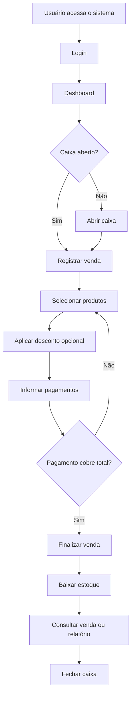

# Adega JF - PDV Local

Sistema web local de ponto de venda para a Adega JF, construído em Flask, SQLite e templates server-side. O projeto cobre autenticação, catálogo de produtos e categorias, controle de caixa, registro de vendas, baixa de estoque, pagamentos, descontos, relatórios operacionais e configurações do usuário.

> Status geral: parcialmente implementado. O núcleo de PDV está funcional, mas ainda não há API JSON pública, controle real por perfis, migrações formais, auditoria, backup automatizado, empacotamento de produção ou hardening completo de segurança.

## Objetivo

Resolver a operação básica de uma adega ou pequeno varejo que precisa controlar produtos, estoque, caixa e vendas em uma aplicação simples, local e de baixa complexidade operacional.

O sistema permite que um operador abra o caixa, registre vendas com múltiplos produtos e múltiplas formas de pagamento, aplique desconto, gere baixa de estoque e acompanhe resultados por período.

## Principais Funcionalidades

- Login, logout, cadastro de usuário e edição de dados do usuário autenticado.
- Criação automática do usuário inicial `admin` com senha `admin123`.
- Cadastro, listagem, edição rápida, ativação/inativação e exclusão de produtos.
- Cadastro, listagem, filtro, edição e exclusão controlada de categorias.
- Produtos do tipo kit, com estoque efetivo calculado a partir de produto base.
- Alerta visual de estoque baixo ou zerado para produtos ativos.
- Abertura e fechamento de caixa.
- Bloqueio de venda sem caixa aberto.
- Registro de venda com itens, desconto, pagamentos e cálculo de troco.
- Múltiplas formas de pagamento: dinheiro, Pix, débito e crédito.
- Baixa automática de estoque ao finalizar venda.
- Consulta de vendas e detalhe da venda.
- Relatórios por período diário, semanal, mensal, anual ou personalizado.
- Cálculo de subtotal, desconto, total vendido, lucro, ticket médio, itens vendidos e produtos mais vendidos.
- Interface responsiva com tema claro/escuro, menu lateral recolhível, abas e autocompletes.
- Testes automatizados para rotas e regras principais.

## Tecnologias Utilizadas

Frontend:
- HTML com Jinja2.
- Bootstrap 5 via CDN.
- CSS customizado em `app/static/css/style.css`.
- JavaScript vanilla em `app/static/js/main.js`.

Backend:
- Python.
- Flask.
- Flask-Login.
- Flask-SQLAlchemy.
- SQLAlchemy.
- Werkzeug para hash e verificação de senha.

Banco de Dados:
- SQLite em `database/adega_jf.db`.
- Modelagem via SQLAlchemy.
- Criação automática por `db.create_all()`.
- Pequenas migrações manuais executadas na inicialização.

Infraestrutura:
- Execução local com servidor de desenvolvimento Flask.
- Não há Docker, WSGI de produção, pipeline CI/CD ou configuração formal de deploy no estado atual.

## Estrutura do Projeto

```text
.
├── app.py
├── config.py
├── requirements.txt
├── app/
│   ├── __init__.py
│   ├── extensions.py
│   ├── models/
│   ├── routes/
│   ├── static/
│   └── templates/
├── database/
│   └── adega_jf.db
├── tests/
│   └── test_routes.py
└── docs/
```

- `app/__init__.py`: fábrica da aplicação, registro de blueprints, criação do banco, migrações manuais e usuário inicial.
- `app/models/`: entidades SQLAlchemy.
- `app/routes/`: rotas web divididas entre autenticação, catálogo e operação principal.
- `app/templates/`: telas Jinja2.
- `app/static/`: CSS e JavaScript da interface.
- `database/`: banco SQLite local.
- `tests/`: testes automatizados com `unittest`.
- `docs/`: documentação técnica e funcional completa.

## Instalação

```bash
cd /Users/rafaelborges/pdv-adega-jf
python3 -m venv .venv
source .venv/bin/activate
python -m pip install -r requirements.txt
```

Requisitos:
- Python 3.10 ou superior.
- `pip`.
- Acesso à internet apenas para instalar dependências e carregar Bootstrap via CDN no navegador.

## Configuração

Variáveis de ambiente reconhecidas:

| Variável | Obrigatória | Padrão | Uso |
|---|---:|---|---|
| `SECRET_KEY` | Não no desenvolvimento, sim em produção | `adega-jf-secret-key` | Assinatura de sessão Flask |
| `PORT` | Não | `5001` | Porta usada por `app.py` |

Configurações atuais em `config.py`:
- `SQLALCHEMY_DATABASE_URI`: aponta para `sqlite:///database/adega_jf.db`.
- `SQLALCHEMY_TRACK_MODIFICATIONS`: `False`.
- `DEBUG`: `True`.

## Como Executar

Há um problema no arquivo `app.py`: ele importa `create_apppy`, mas a função existente é `create_app`. Enquanto isso não for corrigido, executar `python app.py` falha.

Execução alternativa funcional:

```bash
source .venv/bin/activate
flask --app app:create_app run --host 0.0.0.0 --port 5001
```

Depois acesse:

```text
http://localhost:5001
```

Acesso inicial:

```text
Usuário: admin
Senha: admin123
```

Troque a senha imediatamente em ambientes reais.

## Como Fazer Deploy

Deploy de produção ainda não está implementado. O caminho recomendado para produção é:

1. Corrigir `app.py`.
2. Definir `SECRET_KEY` segura por variável de ambiente.
3. Desativar `DEBUG`.
4. Usar servidor WSGI, como Gunicorn ou uWSGI.
5. Colocar Nginx ou proxy equivalente na frente.
6. Configurar HTTPS.
7. Definir política de backup para `database/adega_jf.db`.
8. Substituir migrações manuais por Flask-Migrate/Alembic.

Detalhes estão em [docs/12-deploy.md](docs/12-deploy.md).

## Usuários do Sistema

Implementado:
- Usuário autenticado.
- Campo `role` no banco, com padrão `admin`.
- Todo usuário criado pela tela de cadastro recebe `role='admin'`.

Não implementado:
- Matriz real de permissões por papel.
- Perfis operacionais como operador, gerente, supervisor e cliente.
- Bloqueio por `is_active` no login.

## Fluxo Geral



## Roadmap

Versão atual:
- PDV web local com vendas, estoque, caixa, relatórios e autenticação básica.

Próxima versão recomendada:
- Corrigir `app.py`.
- Implementar permissões reais.
- Adicionar CSRF.
- Remover cadastro livre de administradores.
- Formalizar migrações.
- Implementar backup e restauração.

Melhorias futuras:
- API JSON autenticada.
- Auditoria de ações.
- Impressão de comprovante.
- Exportação de relatórios.
- Cadastro de clientes.
- Controle de fornecedores e compras.
- App mobile/PWA.
- Dashboard gerencial avançado.

## Documentação Técnica

A documentação completa está em `docs/`:

- [01 - Visão Geral](docs/01-visao-geral.md)
- [02 - Requisitos](docs/02-requisitos.md)
- [03 - Arquitetura](docs/03-arquitetura.md)
- [04 - Modelagem do Banco](docs/04-modelagem-banco.md)
- [05 - Regras de Negócio](docs/05-regras-negocio.md)
- [06 - Fluxo do Sistema](docs/06-fluxo-sistema.md)
- [07 - Front-end](docs/07-front-end.md)
- [08 - Back-end](docs/08-back-end.md)
- [09 - Rotas HTTP](docs/09-api.md)
- [10 - Autenticação](docs/10-autenticacao.md)
- [11 - Permissões](docs/11-permissoes.md)
- [12 - Deploy](docs/12-deploy.md)
- [13 - Monitoramento](docs/13-monitoramento.md)
- [14 - Segurança](docs/14-seguranca.md)
- [15 - Testes](docs/15-testes.md)
- [16 - Manutenção](docs/16-manutencao.md)
- [17 - Roadmap](docs/17-roadmap.md)
- [18 - Casos de Uso](docs/18-casos-de-uso.md)
- [19 - Diagrama de Classe](docs/19-diagrama-classe.md)
- [20 - Diagramas de Sequência](docs/20-diagrama-sequencia.md)
- [21 - Glossário](docs/21-glossario.md)
