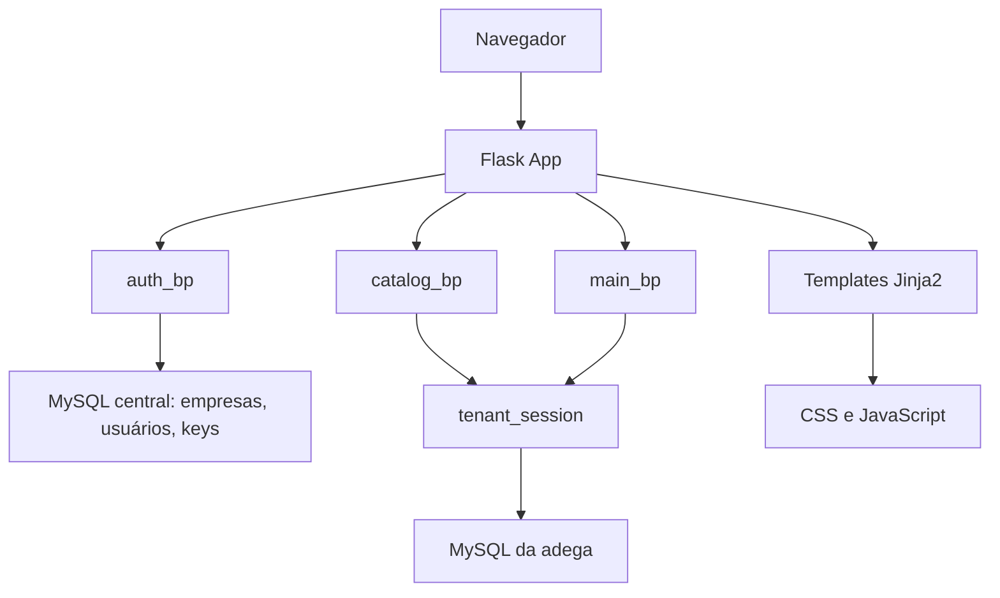

# 03 - Arquitetura

## Visão Arquitetural

O Girofy usa uma arquitetura monolítica web server-side:

- Flask recebe as requisições HTTP.
- Blueprints organizam as rotas por domínio.
- Templates Jinja2 renderizam HTML no servidor.
- JavaScript vanilla adiciona interações de venda, filtros, atalhos, tema e autocomplete.
- SQLAlchemy acessa MySQL.
- Flask-Login gerencia sessão autenticada.
- A camada `tenant.py` seleciona o banco operacional da adega atual.

## Bancos

O sistema trabalha com dois níveis de banco:

- Banco central: cadastro de empresas, usuários, assinatura, keys e dados administrativos.
- Banco por adega: produtos, categorias, vendas, caixa, pagamentos e contas a pagar.

Essa separação evita que uma adega enxergue ou conflite com dados de outra.

## Camadas

### Frontend

Arquivos principais:

- `app/templates/base.html`
- `app/templates/login.html`
- `app/templates/dashboard.html`
- `app/templates/catalog/`
- `app/templates/sales/`
- `app/templates/settings/index.html`
- `app/static/css/style.css`
- `app/static/js/main.js`

Responsabilidades:

- Layout responsivo com menu lateral recolhível.
- Tema claro/escuro.
- Paleta centralizada em tokens CSS com roxo Girofy, ciano de destaque e cores semânticas para status.
- Filtros críticos alinhados por grids responsivos em auditoria, estoque, vendas e produtos.
- Autocomplete de produtos, categorias e funcionários.
- Venda com produtos, desconto, pagamentos, falta e troco.
- Atalhos `F2` para finalização e `F3` para desconto.
- Abas de configurações, caixa, relatórios e painel master.

### Backend

Arquivos principais:

- `app/__init__.py`
- `app/routes/auth.py`
- `app/routes/catalog.py`
- `app/routes/main.py`
- `app/models/`
- `app/tenant.py`
- `app/permissions.py`
- `app/backup.py`
- `app/error_logging.py`

Responsabilidades:

- Criar aplicação e registrar blueprints.
- Criar banco central e bancos das adegas.
- Sincronizar tabelas/colunas esperadas.
- Autenticar usuários.
- Bloquear adegas sem assinatura/key ativa.
- Aplicar permissões por perfil.
- Executar regras de venda, estoque, caixa, relatórios e backup.

## Blueprints

| Blueprint | Arquivo | Responsabilidade |
|---|---|---|
| `auth_bp` | `app/routes/auth.py` | Login, cadastro, master, configurações, assinatura, keys, equipe, backup, importação/exportação visual. |
| `catalog_bp` | `app/routes/catalog.py` | Produtos, categorias, kits, estoque mínimo, importação de planilha. |
| `main_bp` | `app/routes/main.py` | Dashboard, vendas, caixa, relatórios, contas a pagar e exportação CSV. |

## Serviços de Apoio

| Arquivo | Função |
|---|---|
| `app/tenant.py` | Cria/seleciona banco por adega e abre sessões isoladas. |
| `app/permissions.py` | Decorator `permission_required` e nomes de permissões. |
| `app/backup.py` | Gera dump SQL do banco da adega e controla frequência. |
| `app/error_logging.py` | Registra erros com contexto, request id e dados protegidos. |

## Decisões Arquiteturais

- Manter Flask monolítico para acelerar evolução do produto.
- Usar MySQL para permitir bancos separados por adega.
- Evitar API separada neste momento; as telas são renderizadas no servidor.
- Usar permissões no backend, não apenas esconder botões no frontend.
- Gerar backups por adega, pois os dados operacionais ficam fora do banco central.

## Limitações Técnicas

- Ainda não há migração versionada com Alembic.
- Algumas alterações de schema são feitas por funções de compatibilidade em `app/__init__.py`.
- O servidor local só ativa debug quando `FLASK_DEBUG=1`; produção deve usar Gunicorn/Docker.
- Não há fila/background worker; backups automáticos rodam durante requisições autenticadas elegíveis.
