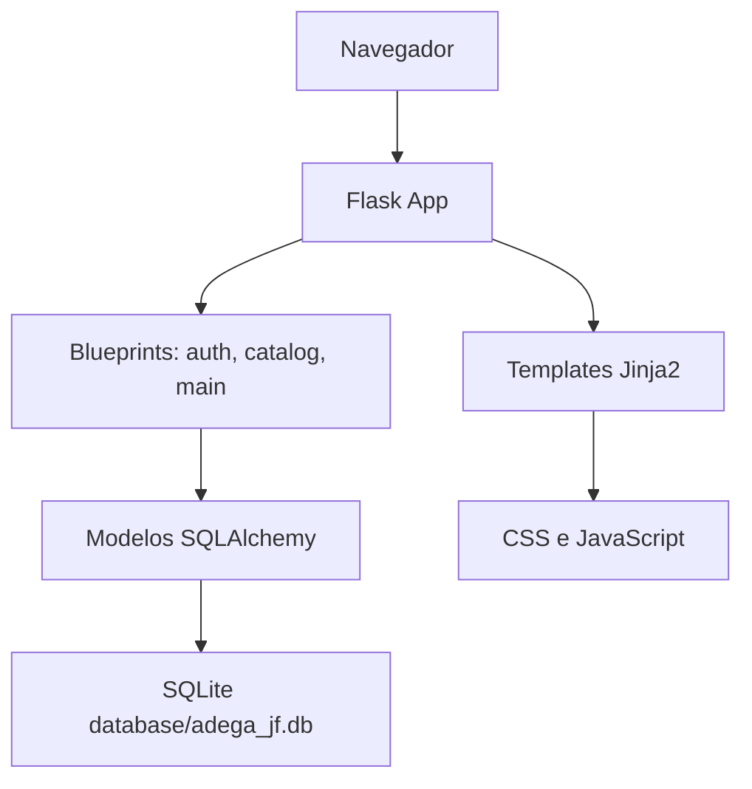
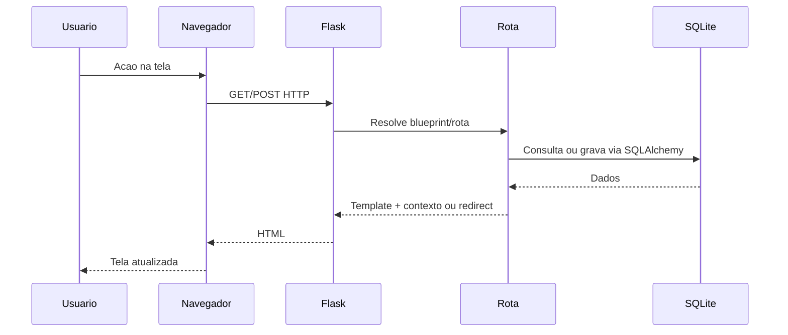
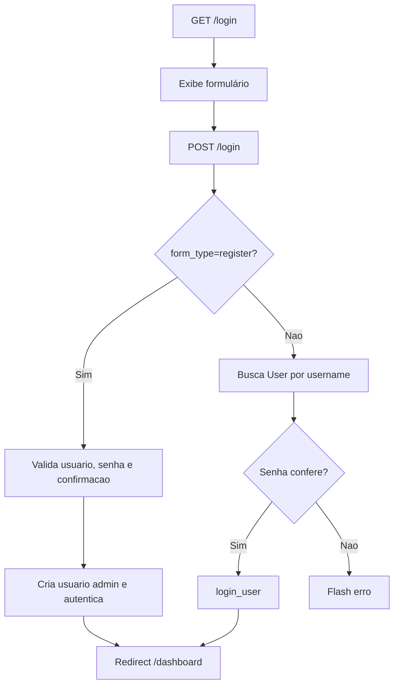

# 03 - Arquitetura

## Visão Arquitetural

O projeto usa arquitetura monolítica web server-side:

- Flask recebe requisições HTTP.
- Blueprints organizam rotas por domínio.
- Templates Jinja2 renderizam HTML no servidor.
- JavaScript adiciona interações no cliente.
- SQLAlchemy acessa o SQLite local.
- Flask-Login gerencia sessão autenticada.



## Camadas

### Frontend

Implementado em:

- `app/templates/`
- `app/static/css/style.css`
- `app/static/js/main.js`

Características:

- Renderização server-side.
- Bootstrap 5 via CDN.
- Tema light/dark salvo em `localStorage`.
- Menu lateral recolhível salvo em `localStorage`.
- Autocomplete de produtos e categorias.
- Cálculo visual de totais, desconto, pagamento, falta e troco.
- Atalhos `F2` para pagamento e `F3` para desconto.

### Backend

Implementado em:

- `app/__init__.py`
- `app/routes/auth.py`
- `app/routes/catalog.py`
- `app/routes/main.py`
- `app/models/`
- `app/extensions.py`

Responsabilidades:

- Criar aplicação.
- Registrar blueprints.
- Inicializar banco.
- Garantir colunas adicionadas manualmente.
- Autenticar usuários.
- Executar regras de venda, estoque, caixa e relatórios.

### Banco de Dados

SQLite local:

```text
database/adega_jf.db
```

Tabelas:

- `users`
- `categories`
- `products`
- `cash_registers`
- `sales`
- `sale_items`
- `payments`

## Fluxo de Requisição



## Fluxo de Autenticação



## Fluxo de Persistência

- Modelos são declarados com Flask-SQLAlchemy.
- `db.create_all()` cria tabelas ausentes.
- Funções `ensure_*_columns()` adicionam colunas ausentes com `ALTER TABLE`.
- Operações usam `db.session.add()`, `db.session.flush()`, `db.session.commit()` e `db.session.rollback()` quando há erro de integridade.

## Blueprints

| Blueprint | Prefixo | Arquivo | Responsabilidade |
|---|---|---|---|
| `auth` | sem prefixo | `app/routes/auth.py` | Login, logout, configurações |
| `catalog` | `/catalogo` | `app/routes/catalog.py` | Produtos e categorias |
| `main` | sem prefixo | `app/routes/main.py` | Dashboard, vendas, caixa, relatórios |

## Ponto de Entrada

Fábrica real:

```python
from app import create_app
```

Problema atual:

```python
from app import create_apppy
```

em `app.py`. Deve ser corrigido para:

```python
from app import create_app
```

## Decisões Técnicas Atuais

- Monólito simples para reduzir complexidade.
- SQLite para operação local.
- Templates server-side para acelerar entrega.
- Sem camada Service/Repository dedicada; regras ficam nas rotas e funções auxiliares.
- Migrações manuais provisórias.

## Pontos de Evolução Arquitetural

- Criar camada de serviços para venda, caixa e estoque.
- Adotar Alembic/Flask-Migrate.
- Separar validações de formulário.
- Criar API JSON versionada.
- Adicionar paginação e índices adicionais.
- Centralizar logs e tratamento de exceções.
