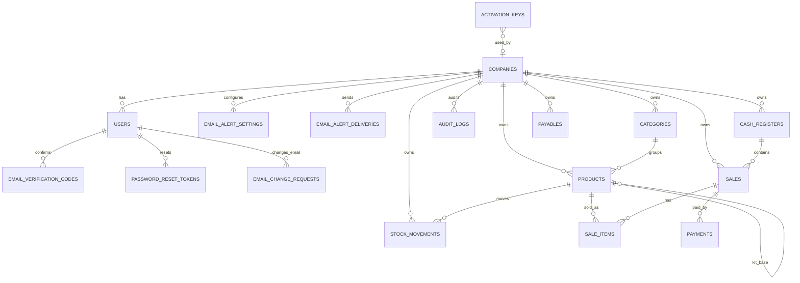

# 04 - Modelagem do Banco

> O schema é versionado por duas árvores Alembic. Veja [29-migracoes-versionadas.md](29-migracoes-versionadas.md). Git versiona código, Alembic versiona schema e backups protegem dados.

## Visão Geral

O sistema usa MySQL em dois níveis:

- Banco central: empresas, usuários, keys e dados administrativos.
- Banco por adega: categorias, produtos, vendas, pagamentos, caixa e contas a pagar.

ORM:

- Flask-SQLAlchemy / SQLAlchemy.

Criação e compatibilidade:

- `db.create_all()` cria tabelas do banco central.
- `tenant.py` cria bancos/tabelas das adegas.
- Funções em `app/__init__.py` garantem colunas adicionadas durante a evolução do projeto.

## Banco Central

### `companies`

Representa cada adega/empresa.

Campos principais:

- `id`
- `name`
- `database_path`
- `active`
- `allow_negative_stock`
- `subscription_plan`
- `billing_cycle`
- `subscription_started_at`
- `subscription_renews_at`
- `activation_key`
- `activation_key_updated_at`
- `pix_fee_enabled`, `debit_fee_enabled`, `credit_fee_enabled`
- `pix_fee_percent`, `debit_fee_percent`, `credit_fee_percent`
- `backup_frequency`
- `backup_last_at`
- `backup_last_path`
- `backup_last_status`
- `created_at`

`allow_negative_stock` define por adega se a venda pode baixar o saldo abaixo de zero. Quando desativado, o comportamento permanece bloqueante.

### `users`

Representa usuários autenticáveis do sistema.

Campos principais:

- `id`
- `username`
- `first_name`
- `last_name`
- `cpf`
- `email`
- `email_verified`
- `email_verified_at`
- `phone`
- `password_hash`
- `role`
- `company_id`
- `is_active`
- `can_view_products`
- `can_manage_products`
- `can_manage_categories`
- `can_manage_sales`
- `can_cancel_sales`
- `can_manage_cash_register`
- `can_view_reports`
- `can_manage_payables`
- `can_manage_settings`
- `can_view_stock_movements`
- `can_manage_stock`
- `can_view_audit_logs`
- `created_at`

Perfis atuais:

- `master`
- `admin`
- `manager`
- `operator`

### `activation_keys`

Representa keys geradas pelo master.

Campos principais:

- `id`
- `key`
- `plan`
- `renews_at`
- `active`
- `used_by_company_id`
- `used_at`
- `created_at`

### `email_verification_codes`

Representa códigos temporários para confirmar e-mail no cadastro.

Campos principais:

- `id`
- `user_id`
- `code_hash`
- `expires_at`
- `used`
- `attempts`
- `created_at`

### `password_reset_tokens`

Representa tokens temporários para redefinição de senha.

Campos principais:

- `id`
- `user_id`
- `token_hash`
- `expires_at`
- `used`
- `created_at`

### `email_change_requests`

Representa solicitações temporárias para trocar e-mail confirmando pelo e-mail antigo.

Campos principais:

- `id`
- `user_id`
- `old_email`
- `new_email`
- `token_hash`
- `expires_at`
- `used`
- `created_at`
- `confirmed_at`

### `email_alert_settings`

Representa a configuração de alertas críticos por e-mail por adega.

Campos principais:

- `id`
- `company_id`
- `alert_type`
- `enabled`
- `recipients`
- `created_at`
- `updated_at`

### `email_alert_deliveries`

Representa alertas por e-mail já enviados, evitando repetição do mesmo alerta.

Campos principais:

- `id`
- `company_id`
- `alert_type`
- `alert_key`
- `recipients`
- `sent_at`

## Banco da Adega

Cada adega possui as tabelas operacionais abaixo em seu próprio banco.

### `categories`

- `id`
- `name`
- `company_id`
- `created_at`

Regra: o nome é único dentro da adega, não globalmente entre todas as adegas.

### `products`

- `id`
- `name`
- `barcode`
- `category_id`
- `company_id`
- `cost_price`
- `sale_price`
- `stock_quantity`
- `min_stock_quantity`
- `active`
- `is_kit`
- `kit_component_product_id`
- `kit_component_quantity`
- `created_at`

Regras:

- Código de barras não pode duplicar dentro da adega.
- Kit baixa estoque do produto base.
- Estoque mínimo gera notificação.

### `cash_registers`

- `id`
- `opened_at`
- `closed_at`
- `opening_amount`
- `closing_amount`
- `status`
- `user_id`
- `company_id`

### `sales`

- `id`
- `created_at`
- `total_amount`
- `discount_amount`
- `final_amount`
- `payment_status`
- `status`: `completed` ou `cancelled`
- `cancelled_at`
- `cancelled_by_user_id`
- `cancellation_reason`
- `user_id`
- `company_id`
- `cash_register_id`

O cancelamento é lógico: a linha de `sales` e seus registros em `sale_items` e `payments`
permanecem armazenados. `cancelled_by_user_id` referencia o usuário que executou a operação.
Bases existentes recebem as colunas pelo mecanismo de compatibilidade atual, tanto no banco
central quanto nos bancos por tenant. Vendas legadas são normalizadas para `completed`.

### `sale_items`

- `id`
- `sale_id`
- `product_id`
- `quantity`
- `unit_price`
- `unit_cost_price`
- `total_price`
- `profit_amount`

### `payments`

- `id`
- `sale_id`
- `method`
- `amount`

Métodos:

- `money`
- `pix`
- `debit`
- `credit`

### `payables`

- `id`
- `company_id`
- `description`
- `category`
- `amount`
- `due_date`
- `paid`
- `paid_at`
- `notes`
- `created_at`

### `stock_movements`

Registra cada alteração no saldo de estoque. O saldo atual permanece em
`products.stock_quantity`, mas alterações feitas por cadastro, edição, importação,
venda, entrada ou ajuste geram uma linha nesta tabela.

Campos principais:

- `id`
- `company_id`
- `product_id`
- `user_id`
- `movement_type`
- `source_type`
- `source_id`
- `quantity`
- `previous_stock`
- `new_stock`
- `unit_cost`
- `total_cost`
- `reason`
- `notes`
- `created_at`

Tipos atuais:

- `entry`
- `sale`
- `adjustment_in`
- `adjustment_out`
- `return`
- `cancellation`
- `initial_stock`
- `import`

Origens atuais:

- `manual`
- `sale`
- `product_creation`
- `product_edit`
- `spreadsheet_import`
- `sale_cancellation`
- `system`

### `audit_logs`

Registra ações críticas do sistema com contexto da requisição e valores sanitizados.

Campos principais:

- `id`
- `company_id`
- `user_id`
- `user_name`
- `user_role`
- `action`
- `entity_type`
- `entity_id`
- `description`
- `old_values`
- `new_values`
- `ip_address`
- `user_agent`
- `request_id`
- `route`
- `http_method`
- `created_at`

Valores sensíveis como senha, token, secret, API key e key de ativação são mascarados
antes de gravar.

## Tabelas Ainda Não Existentes

- `customers`: clientes.
- `suppliers`: fornecedores.
- `purchases`: compras/entrada de mercadoria.

## Observações Importantes

- `database_path` em `companies` guarda o nome do banco MySQL da adega.
- O campo `company_id` também existe em tabelas operacionais para reforçar vínculo lógico.
- A separação principal entre adegas é feita pelo banco selecionado em `tenant_session`.
- O projeto ainda não usa Alembic; mudanças de schema são aplicadas por compatibilidade no start da aplicação.
