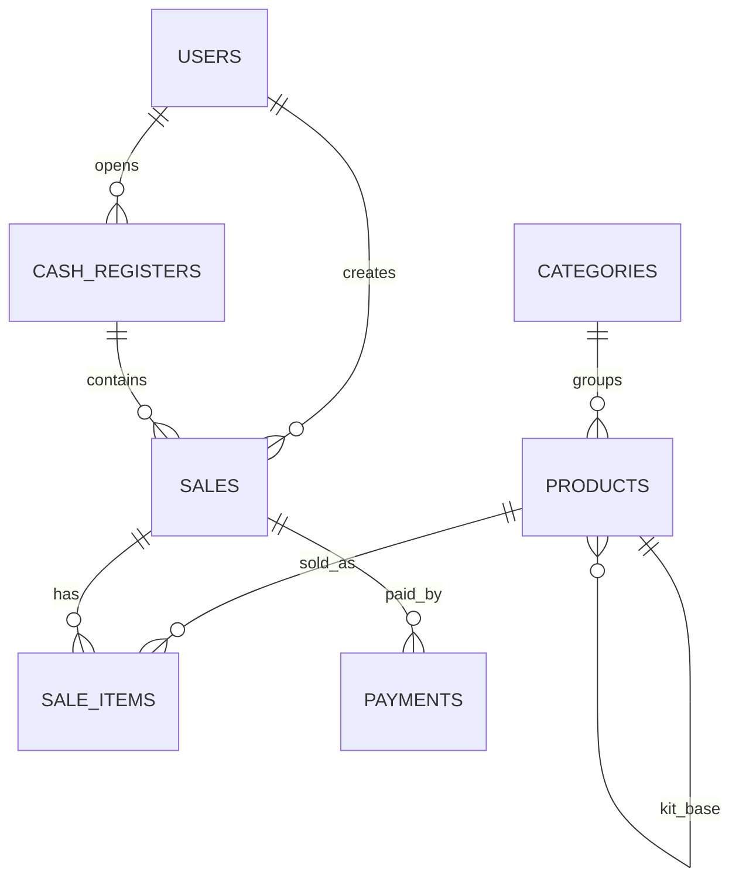

# 04 - Modelagem do Banco

## Visão Geral

Banco atual: SQLite em `database/adega_jf.db`.

ORM: Flask-SQLAlchemy.

Criação:

- Tabelas criadas por `db.create_all()`.
- Colunas novas adicionadas por funções manuais em `app/__init__.py`.

## Tabela `users`

Finalidade: armazenar usuários autenticáveis.

| Campo | Tipo | Obrigatório | Chave/Índice | Descrição |
|---|---|---:|---|---|
| `id` | Integer | Sim | PK | Identificador |
| `username` | String(80) | Sim | Unique | Login do usuário |
| `first_name` | String(120) | Não |  | Nome |
| `last_name` | String(120) | Não |  | Sobrenome |
| `email` | String(255) | Não |  | Email |
| `phone` | String(40) | Não |  | Telefone |
| `password_hash` | String(255) | Sim |  | Hash da senha |
| `role` | String(50) | Não |  | Papel do usuário; padrão `admin` |
| `is_active` | Boolean | Não |  | Indicador de ativo |
| `created_at` | DateTime | Não |  | Data de criação |

Observações:

- `is_active` não é validado no login.
- `role` não é usado para autorização.
- Métodos: `set_password()`, `check_password()`.
- Propriedades: `full_name`, `masked_email`, `password_fingerprint`.

## Tabela `categories`

Finalidade: agrupar produtos.

| Campo | Tipo | Obrigatório | Chave/Índice | Descrição |
|---|---|---:|---|---|
| `id` | Integer | Sim | PK | Identificador |
| `name` | String(120) | Sim | Unique | Nome da categoria |
| `created_at` | DateTime | Não |  | Data de criação |

Relacionamentos:

- `Category.products` para `Product`.

Regra:

- Categoria com produtos vinculados não pode ser excluída pela tela atual.

## Tabela `products`

Finalidade: armazenar produtos vendáveis e produtos do tipo kit.

| Campo | Tipo | Obrigatório | Chave/Índice | Descrição |
|---|---|---:|---|---|
| `id` | Integer | Sim | PK | Identificador |
| `name` | String(200) | Sim |  | Nome |
| `barcode` | String(100) | Não | Unique | Código de barras |
| `category_id` | Integer | Não | FK | Categoria |
| `cost_price` | Float | Não |  | Preço de custo |
| `sale_price` | Float | Não |  | Preço de venda |
| `stock_quantity` | Integer | Não |  | Estoque físico |
| `active` | Boolean | Não |  | Produto disponível para venda |
| `is_kit` | Boolean | Não |  | Indica kit |
| `kit_component_product_id` | Integer | Não | FK self | Produto base do kit |
| `kit_component_quantity` | Integer | Não |  | Quantidade do produto base baixada por kit |
| `created_at` | DateTime | Não |  | Data de criação |

Relacionamentos:

- `Product.category`.
- `Product.kit_component`.

Propriedades:

- `effective_stock_quantity`: se kit, retorna `kit_component.stock_quantity // kit_component_quantity`; senão, `stock_quantity`.
- `profit_amount`: `sale_price - cost_price`.
- `profit_margin_percent`: `profit_amount / sale_price * 100`.

## Tabela `cash_registers`

Finalidade: controlar abertura e fechamento de caixa.

| Campo | Tipo | Obrigatório | Chave/Índice | Descrição |
|---|---|---:|---|---|
| `id` | Integer | Sim | PK | Identificador |
| `opened_at` | DateTime | Não |  | Data/hora de abertura |
| `closed_at` | DateTime | Não |  | Data/hora de fechamento |
| `opening_amount` | Float | Não |  | Valor inicial |
| `closing_amount` | Float | Não |  | Valor final informado |
| `status` | String(20) | Não |  | `open` ou `closed` |
| `user_id` | Integer | Não | FK | Usuário que abriu |

Relacionamentos:

- `CashRegister.sales`.

## Tabela `sales`

Finalidade: cabeçalho da venda.

| Campo | Tipo | Obrigatório | Chave/Índice | Descrição |
|---|---|---:|---|---|
| `id` | Integer | Sim | PK | Identificador |
| `created_at` | DateTime | Não |  | Data/hora |
| `total_amount` | Float | Não |  | Subtotal antes de desconto |
| `discount_amount` | Float | Não |  | Desconto |
| `final_amount` | Float | Não |  | Total final |
| `payment_status` | String(20) | Não |  | Atual: `paid` nas vendas finalizadas |
| `user_id` | Integer | Não | FK | Usuário vendedor |
| `cash_register_id` | Integer | Não | FK | Caixa da venda |

Relacionamentos:

- `Sale.items`.
- `Sale.payments`.

## Tabela `sale_items`

Finalidade: itens de venda.

| Campo | Tipo | Obrigatório | Chave/Índice | Descrição |
|---|---|---:|---|---|
| `id` | Integer | Sim | PK | Identificador |
| `sale_id` | Integer | Não | FK | Venda |
| `product_id` | Integer | Não | FK | Produto |
| `quantity` | Integer | Não |  | Quantidade |
| `unit_price` | Float | Não |  | Preço unitário no momento da venda |
| `unit_cost_price` | Float | Não |  | Custo unitário no momento da venda |
| `total_price` | Float | Não |  | Total da linha |
| `profit_amount` | Float | Não |  | Lucro bruto da linha |

## Tabela `payments`

Finalidade: formas e valores pagos em uma venda.

| Campo | Tipo | Obrigatório | Chave/Índice | Descrição |
|---|---|---:|---|---|
| `id` | Integer | Sim | PK | Identificador |
| `sale_id` | Integer | Não | FK | Venda |
| `method` | String(50) | Não |  | `money`, `pix`, `debit`, `credit` |
| `amount` | Float | Não |  | Valor pago |

## Índices e Chaves

Índices únicos automáticos:

- `users.username`.
- `categories.name`.
- `products.barcode`.

Chaves estrangeiras declaradas no ORM:

- `products.category_id -> categories.id`.
- `products.kit_component_product_id -> products.id`.
- `cash_registers.user_id -> users.id`.
- `sales.user_id -> users.id`.
- `sales.cash_register_id -> cash_registers.id`.
- `sale_items.sale_id -> sales.id`.
- `sale_items.product_id -> products.id`.
- `payments.sale_id -> sales.id`.

## Migrações Manuais Atuais

Arquivo: `app/__init__.py`.

- `ensure_product_kit_columns()`: adiciona `is_kit`, `kit_component_product_id`, `kit_component_quantity`.
- `ensure_sale_discount_columns()`: adiciona `discount_amount`.
- `ensure_sale_item_profit_columns()`: adiciona `unit_cost_price`, `profit_amount`.
- `ensure_user_profile_columns()`: adiciona `first_name`, `last_name`, `email`, `phone`.

Limitação: não há versionamento, rollback ou histórico formal de migração.
