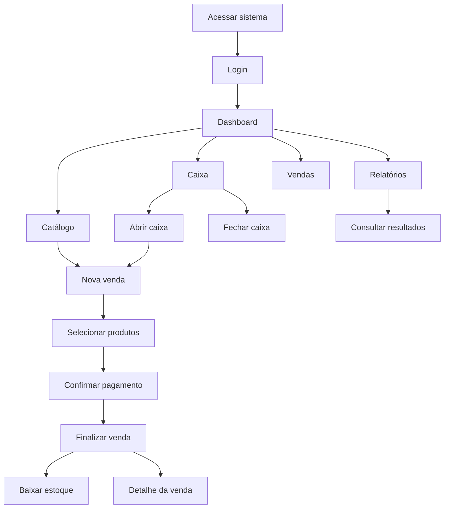
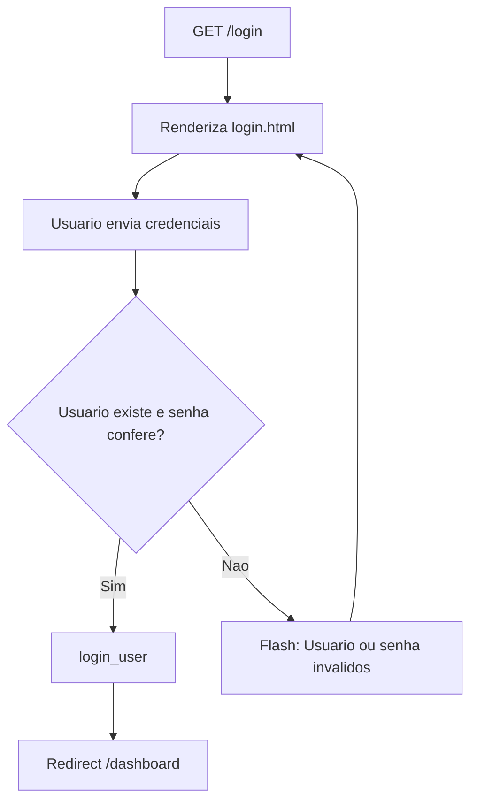
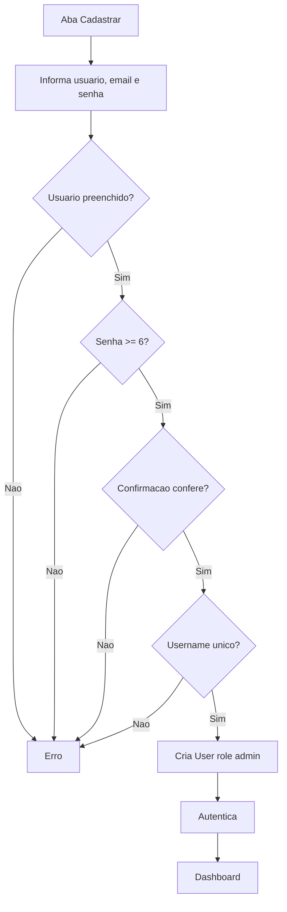
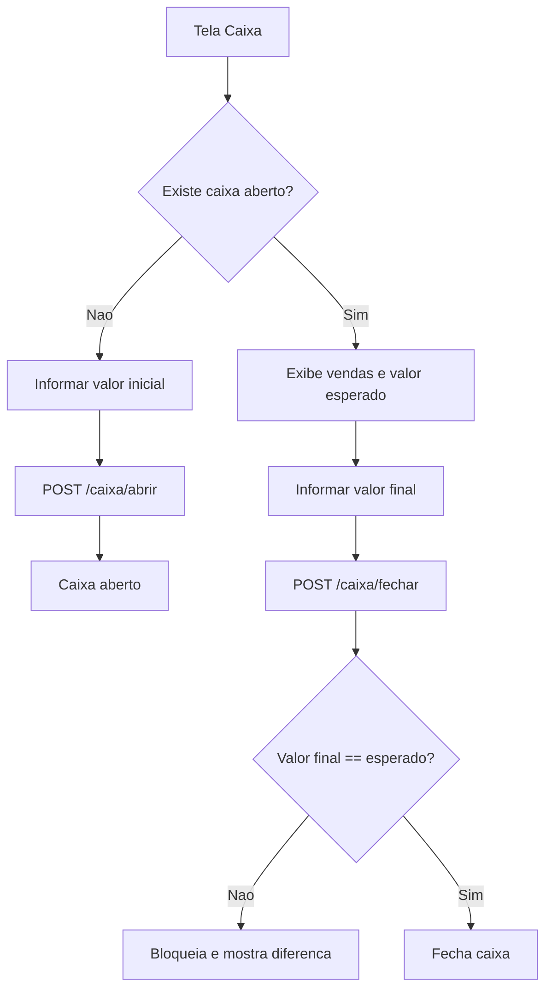
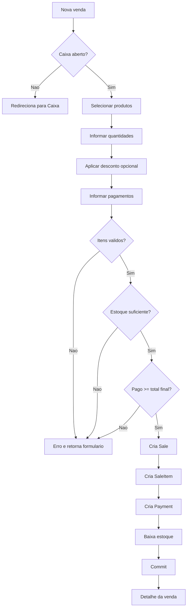
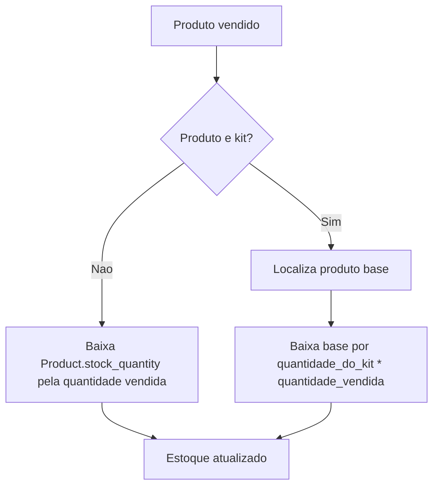
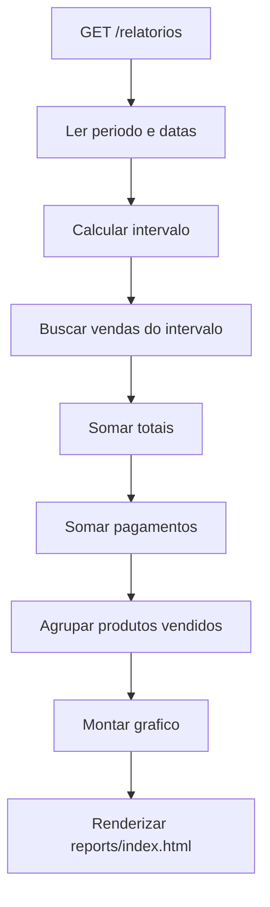
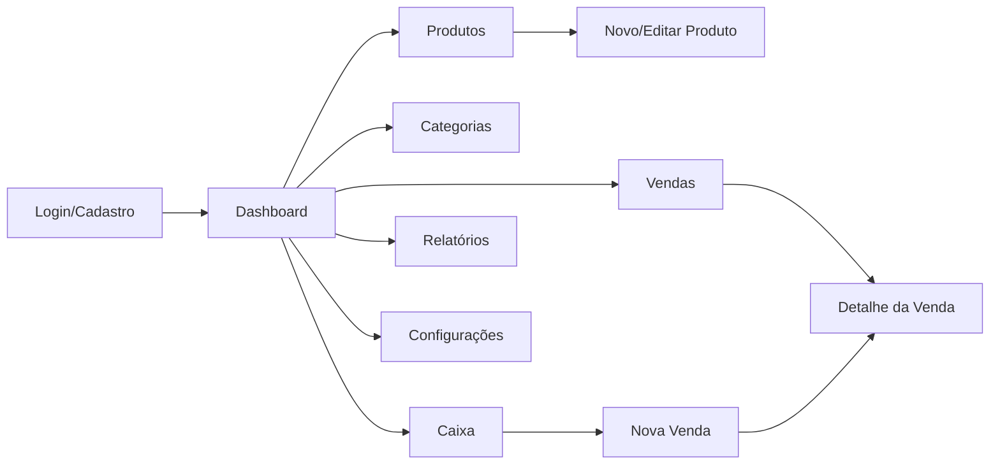

# 06 - Fluxo do Sistema

## Fluxo Geral

```mermaid
flowchart TD
    A["Acessar sistema"] --> B["Login"]
    B --> C["Dashboard"]
    C --> D["Catálogo"]
    C --> E["Caixa"]
    C --> F["Vendas"]
    C --> G["Relatórios"]
    E --> H["Abrir caixa"]
    H --> I["Nova venda"]
    D --> I
    I --> J["Selecionar produtos"]
    J --> K["Confirmar pagamento"]
    K --> L["Finalizar venda"]
    L --> M["Baixar estoque"]
    L --> N["Detalhe da venda"]
    G --> O["Consultar resultados"]
    E --> P["Fechar caixa"]
```

## Fluxo de Login

```mermaid
flowchart TD
    A["GET /login"] --> B["Renderiza login.html"]
    B --> C["Usuario envia credenciais"]
    C --> D{"Usuario existe e senha confere?"}
    D -- "Sim" --> E["login_user"]
    E --> F["Redirect /dashboard"]
    D -- "Nao" --> G["Flash: Usuario ou senha invalidos"]
    G --> B
```

## Fluxo de Cadastro

```mermaid
flowchart TD
    A["Aba Cadastrar"] --> B["Informa usuario, email e senha"]
    B --> C{"Usuario preenchido?"}
    C -- "Nao" --> X["Erro"]
    C -- "Sim" --> D{"Senha >= 6?"}
    D -- "Nao" --> X
    D -- "Sim" --> E{"Confirmacao confere?"}
    E -- "Nao" --> X
    E -- "Sim" --> F{"Username unico?"}
    F -- "Nao" --> X
    F -- "Sim" --> G["Cria User role admin"]
    G --> H["Autentica"]
    H --> I["Dashboard"]
```

## Fluxo de Caixa

```mermaid
flowchart TD
    A["Tela Caixa"] --> B{"Existe caixa aberto?"}
    B -- "Nao" --> C["Informar valor inicial"]
    C --> D["POST /caixa/abrir"]
    D --> E["Caixa aberto"]
    B -- "Sim" --> F["Exibe vendas e valor esperado"]
    F --> G["Informar valor final"]
    G --> H["POST /caixa/fechar"]
    H --> I{"Valor final == esperado?"}
    I -- "Nao" --> J["Bloqueia e mostra diferenca"]
    I -- "Sim" --> K["Fecha caixa"]
```

## Fluxo de Venda

```mermaid
flowchart TD
    A["Nova venda"] --> B{"Caixa aberto?"}
    B -- "Nao" --> C["Redireciona para Caixa"]
    B -- "Sim" --> D["Selecionar produtos"]
    D --> E["Informar quantidades"]
    E --> F["Aplicar desconto opcional"]
    F --> G["Informar pagamentos"]
    G --> H{"Itens validos?"}
    H -- "Nao" --> X["Erro e retorna formulario"]
    H -- "Sim" --> I{"Estoque suficiente?"}
    I -- "Nao" --> X
    I -- "Sim" --> J{"Pago >= total final?"}
    J -- "Nao" --> X
    J -- "Sim" --> K["Cria Sale"]
    K --> L["Cria SaleItem"]
    L --> M["Cria Payment"]
    M --> N["Baixa estoque"]
    N --> O["Commit"]
    O --> P["Detalhe da venda"]
```

## Fluxo de Estoque

```mermaid
flowchart TD
    A["Produto vendido"] --> B{"Produto e kit?"}
    B -- "Nao" --> C["Baixa Product.stock_quantity pela quantidade vendida"]
    B -- "Sim" --> D["Localiza produto base"]
    D --> E["Baixa base por quantidade_do_kit * quantidade_vendida"]
    C --> F["Estoque atualizado"]
    E --> F
```

## Fluxo de Relatórios

```mermaid
flowchart TD
    A["GET /relatorios"] --> B["Ler periodo e datas"]
    B --> C["Calcular intervalo"]
    C --> D["Buscar vendas do intervalo"]
    D --> E["Somar totais"]
    E --> F["Somar pagamentos"]
    F --> G["Agrupar produtos vendidos"]
    G --> H["Montar grafico"]
    H --> I["Renderizar reports/index.html"]
```

## Fluxo de Telas

```mermaid
flowchart LR
    Login["Login/Cadastro"] --> Dashboard["Dashboard"]
    Dashboard --> Produtos["Produtos"]
    Produtos --> ProdutoForm["Novo/Editar Produto"]
    Dashboard --> Categorias["Categorias"]
    Dashboard --> Caixa["Caixa"]
    Caixa --> NovaVenda["Nova Venda"]
    Dashboard --> Vendas["Vendas"]
    Vendas --> DetalheVenda["Detalhe da Venda"]
    NovaVenda --> DetalheVenda
    Dashboard --> Relatorios["Relatórios"]
    Dashboard --> Config["Configurações"]
```
