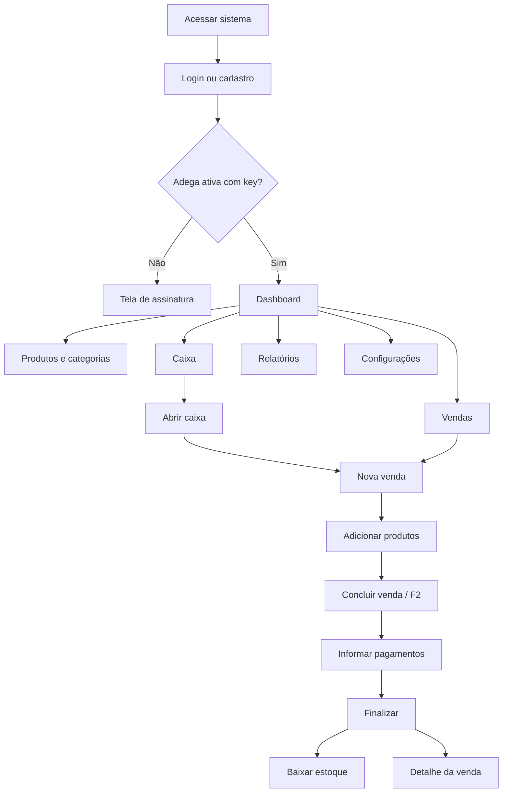
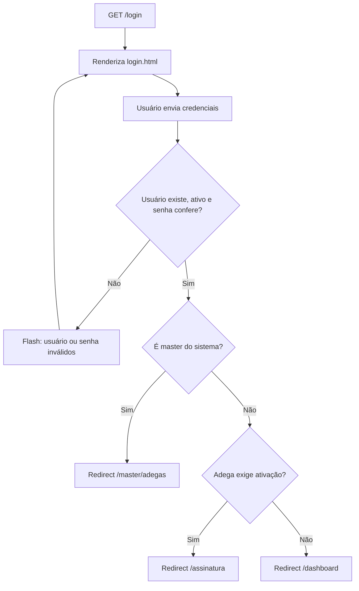
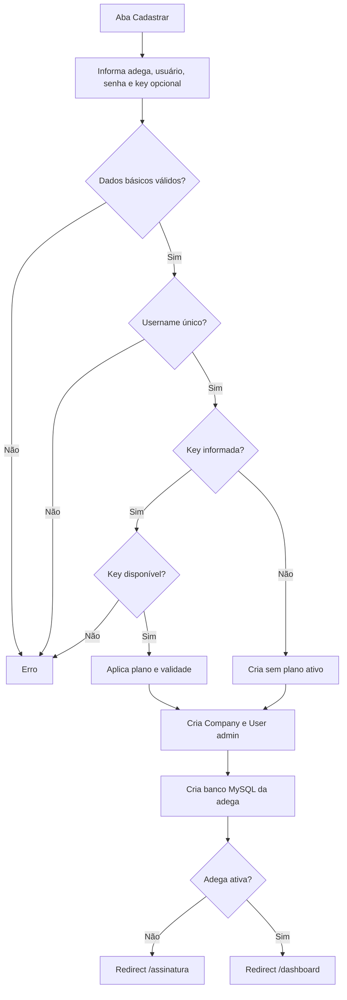
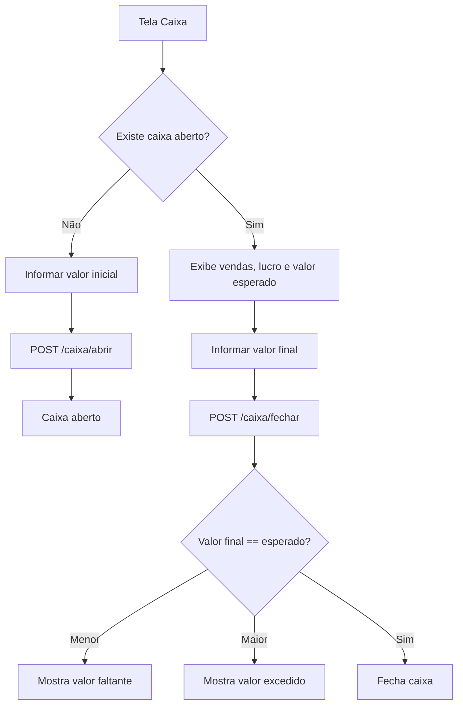
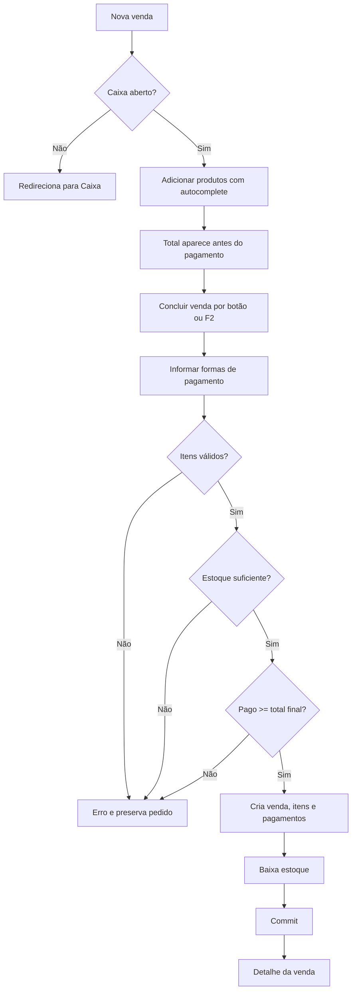
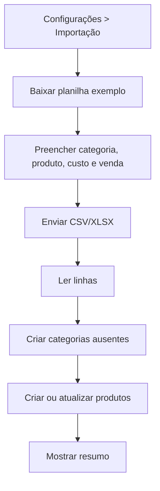
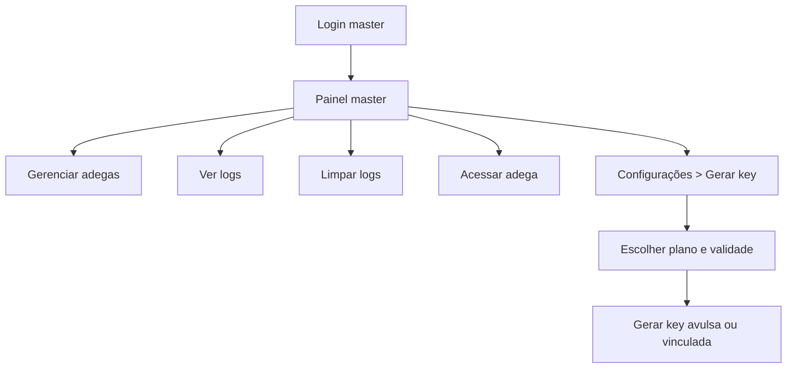

# 06 - Fluxo do Sistema

## Fluxo Geral

```mermaid
flowchart TD
    A["Acessar sistema"] --> B["Login ou cadastro"]
    B --> C{"Adega ativa com key?"}
    C -- "Não" --> D["Tela de assinatura"]
    C -- "Sim" --> E["Dashboard"]
    E --> F["Produtos e categorias"]
    E --> G["Caixa"]
    E --> H["Vendas"]
    E --> I["Relatórios"]
    E --> J["Configurações"]
    G --> K["Abrir caixa"]
    K --> L["Nova venda"]
    H --> L
    L --> M["Adicionar produtos"]
    M --> N["Concluir venda / F2"]
    N --> O["Informar pagamentos"]
    O --> P["Finalizar"]
    P --> Q["Baixar estoque"]
    P --> R["Detalhe da venda"]
```

## Fluxo de Login

```mermaid
flowchart TD
    A["GET /login"] --> B["Renderiza login.html"]
    B --> C["Usuário envia credenciais"]
    C --> D{"Usuário existe, ativo e senha confere?"}
    D -- "Não" --> E["Flash: usuário ou senha inválidos"]
    E --> B
    D -- "Sim" --> F{"É master do sistema?"}
    F -- "Sim" --> G["Redirect /master/adegas"]
    F -- "Não" --> H{"Adega exige ativação?"}
    H -- "Sim" --> I["Redirect /assinatura"]
    H -- "Não" --> J["Redirect /dashboard"]
```

## Fluxo de Cadastro

```mermaid
flowchart TD
    A["Aba Cadastrar"] --> B["Informa adega, usuário, senha e key opcional"]
    B --> C{"Dados básicos válidos?"}
    C -- "Não" --> X["Erro"]
    C -- "Sim" --> D{"Username único?"}
    D -- "Não" --> X
    D -- "Sim" --> E{"Key informada?"}
    E -- "Sim" --> F{"Key disponível?"}
    F -- "Não" --> X
    F -- "Sim" --> G["Aplica plano e validade"]
    E -- "Não" --> H["Cria sem plano ativo"]
    G --> I["Cria Company e User admin"]
    H --> I
    I --> J["Cria banco MySQL da adega"]
    J --> K{"Adega ativa?"}
    K -- "Não" --> L["Redirect /assinatura"]
    K -- "Sim" --> M["Redirect /dashboard"]
```

## Fluxo de Caixa

```mermaid
flowchart TD
    A["Tela Caixa"] --> B{"Existe caixa aberto?"}
    B -- "Não" --> C["Informar valor inicial"]
    C --> D["POST /caixa/abrir"]
    D --> E["Caixa aberto"]
    B -- "Sim" --> F["Exibe vendas, lucro e valor esperado"]
    F --> G["Informar valor final"]
    G --> H["POST /caixa/fechar"]
    H --> I{"Valor final == esperado?"}
    I -- "Menor" --> J["Mostra valor faltante"]
    I -- "Maior" --> K["Mostra valor excedido"]
    I -- "Sim" --> L["Fecha caixa"]
```

## Fluxo de Venda

```mermaid
flowchart TD
    A["Nova venda"] --> B{"Caixa aberto?"}
    B -- "Não" --> C["Redireciona para Caixa"]
    B -- "Sim" --> D["Adicionar produtos com autocomplete"]
    D --> E["Total aparece antes do pagamento"]
    E --> F["Concluir venda por botão ou F2"]
    F --> G["Informar formas de pagamento"]
    G --> H{"Itens válidos?"}
    H -- "Não" --> X["Erro e preserva pedido"]
    H -- "Sim" --> I{"Estoque suficiente?"}
    I -- "Não" --> X
    I -- "Sim" --> J{"Pago >= total final?"}
    J -- "Não" --> X
    J -- "Sim" --> K["Cria venda, itens e pagamentos"]
    K --> L["Baixa estoque"]
    L --> M["Commit"]
    M --> N["Detalhe da venda"]
```

## Fluxo de Importação

```mermaid
flowchart TD
    A["Configurações > Importação"] --> B["Baixar planilha exemplo"]
    B --> C["Preencher categoria, produto, custo e venda"]
    C --> D["Enviar CSV/XLSX"]
    D --> E["Ler linhas"]
    E --> F["Criar categorias ausentes"]
    F --> G["Criar ou atualizar produtos"]
    G --> H["Mostrar resumo"]
```

## Fluxo do Master

```mermaid
flowchart TD
    A["Login master"] --> B["Painel master"]
    B --> C["Gerenciar adegas"]
    B --> D["Ver logs"]
    B --> E["Limpar logs"]
    B --> F["Acessar adega"]
    B --> G["Configurações > Gerar key"]
    G --> H["Escolher plano e validade"]
    H --> I["Gerar key avulsa ou vinculada"]
```
