# 06 - Fluxo do Sistema

## Fluxo Geral

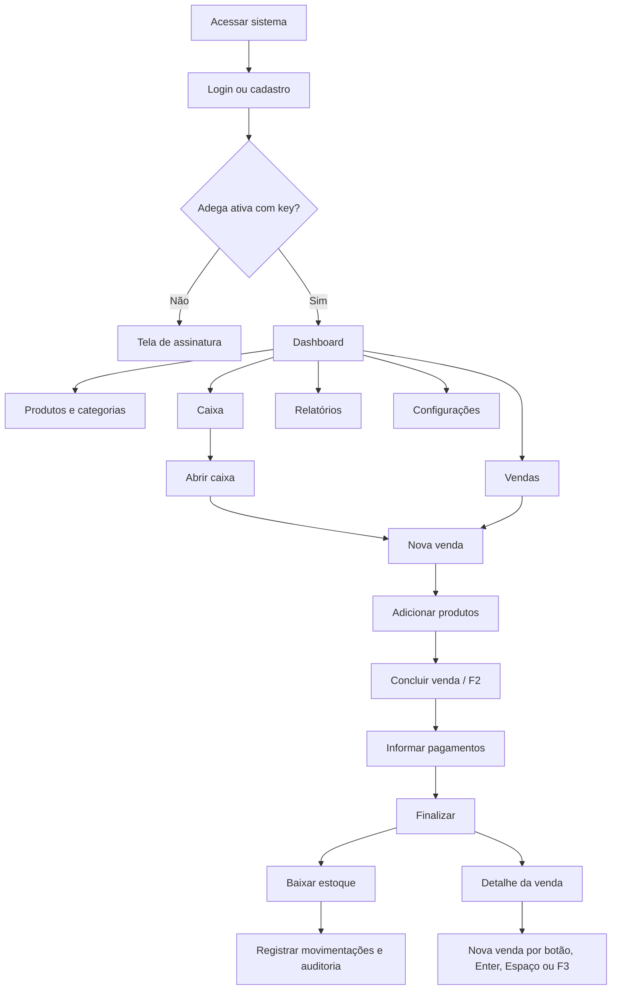

## Fluxo de Login

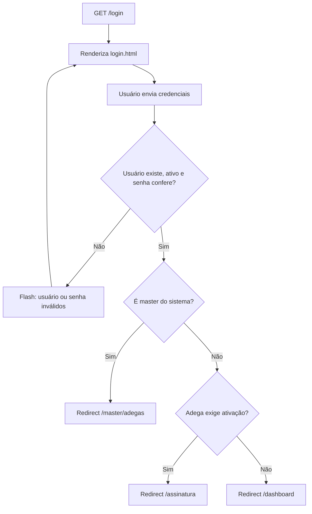

## Fluxo de Cadastro

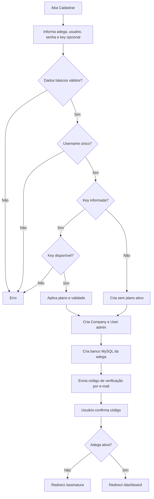

## Fluxo de Caixa

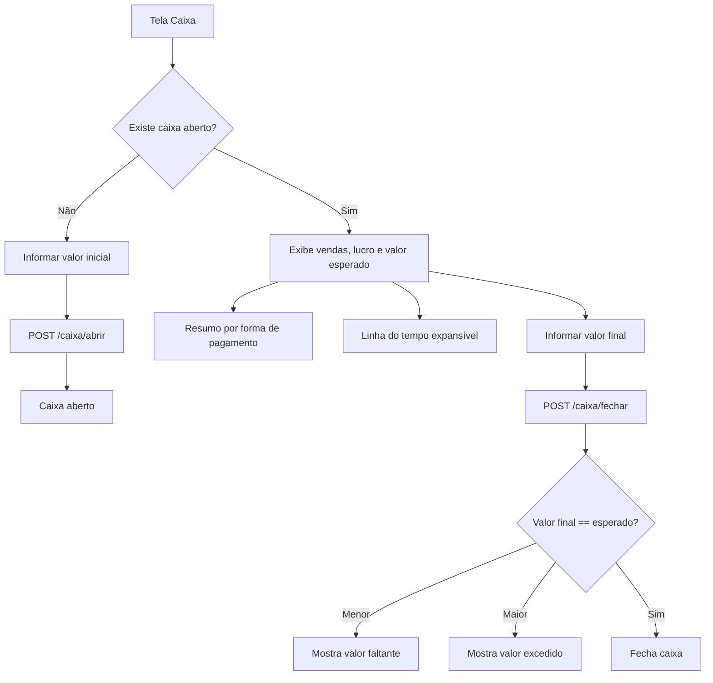

## Fluxo de Venda

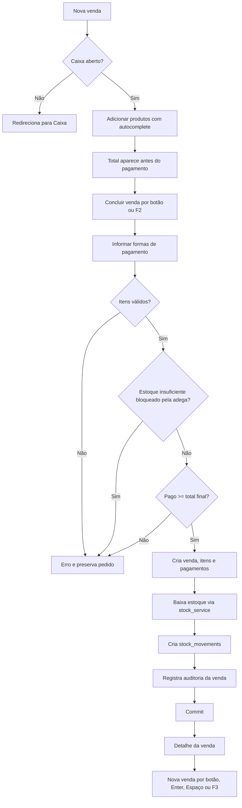

## Fluxo de Relatório por Produto

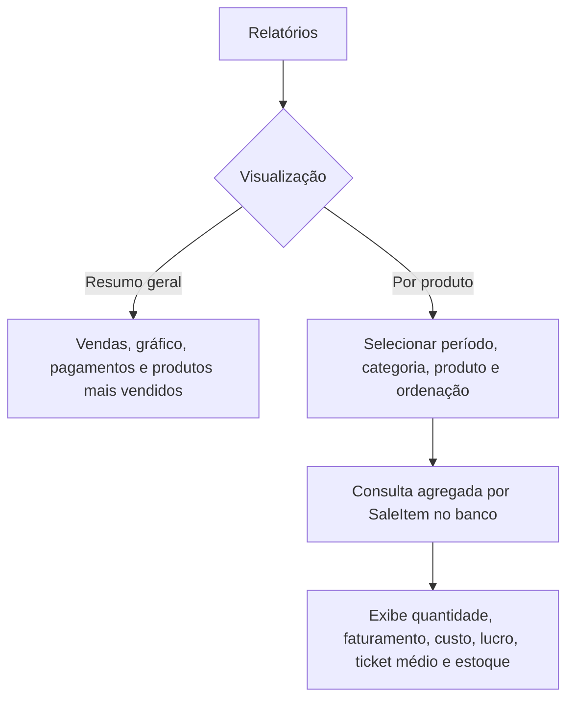

## Fluxo de Linha do Tempo do Caixa

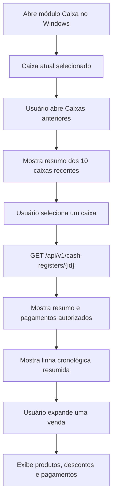

## Fluxo de Importação

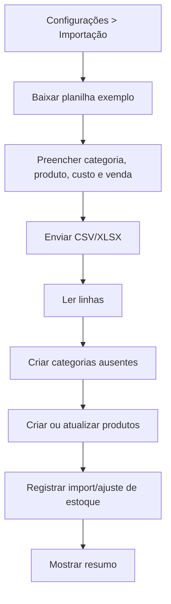

## Fluxo de Entrada/Ajuste de Estoque

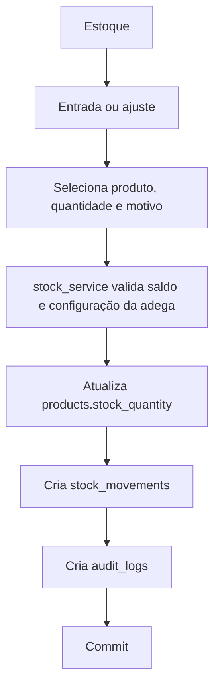

## Fluxo de Auditoria

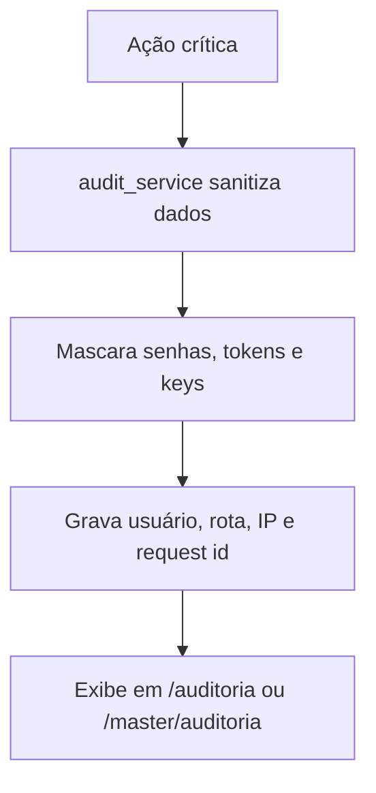

## Fluxo do Master

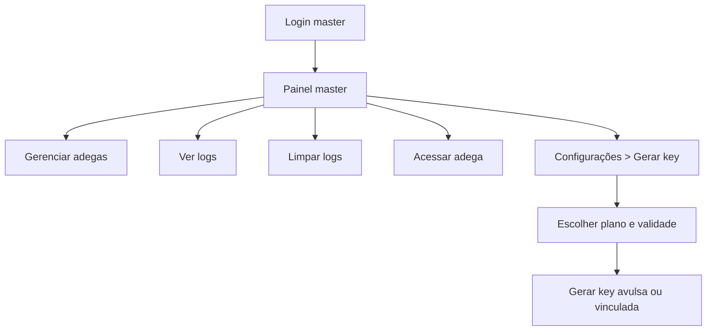
