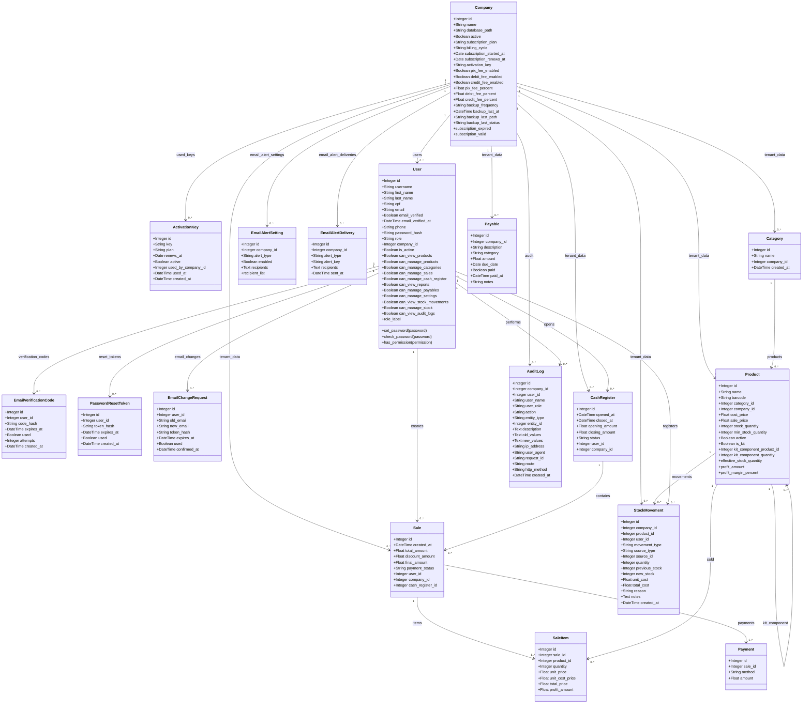

# 19 - Diagrama de Classe

## Diagrama Mermaid

## Observações

- `Company` fica no banco central e representa uma adega.
- Os dados operacionais ficam no banco MySQL da adega selecionada.
- `ActivationKey` permite gerar keys avulsas ou vinculadas a uma empresa.
- `Product` possui relacionamento autorreferente para suportar kits.
- `Payable` alimenta alertas de contas vencidas e próximas do vencimento.
- Permissões são controladas no modelo `User` e aplicadas nas rotas.
