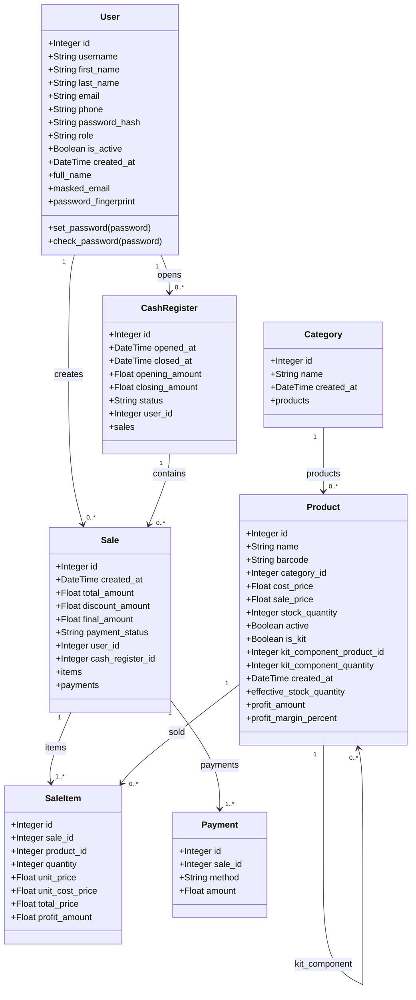

# 19 - Diagrama de Classe

## Diagrama Mermaid

## Observações

- `Product` possui relacionamento autorreferente para suportar kits.
- `Sale` remove itens e pagamentos em cascata quando excluída pelo ORM.
- Não há relacionamento explícito `User.sales` no model, embora a FK exista.
- `CashRegister.sales` usa `backref`.
