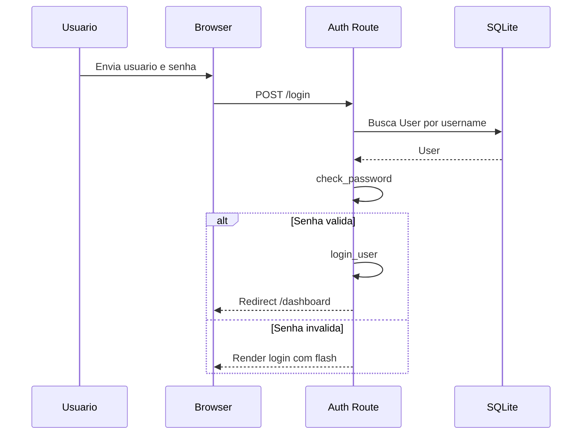
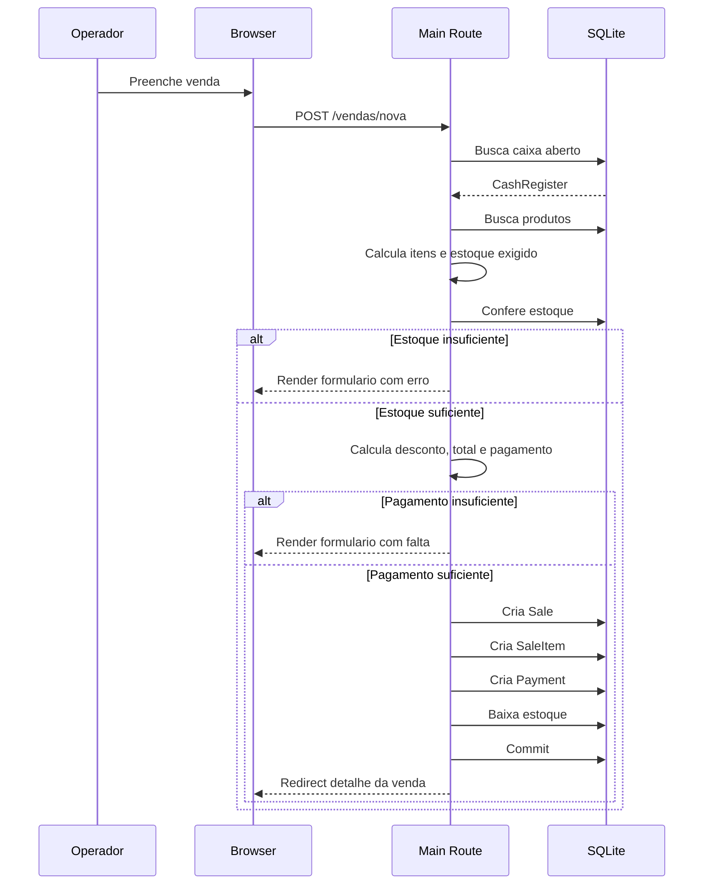
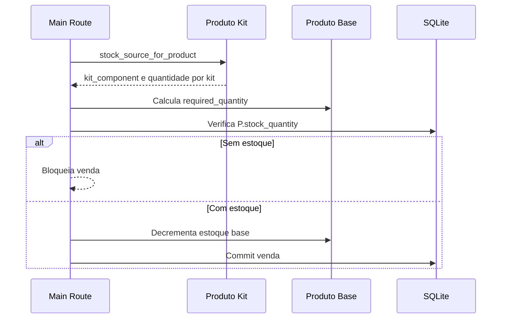
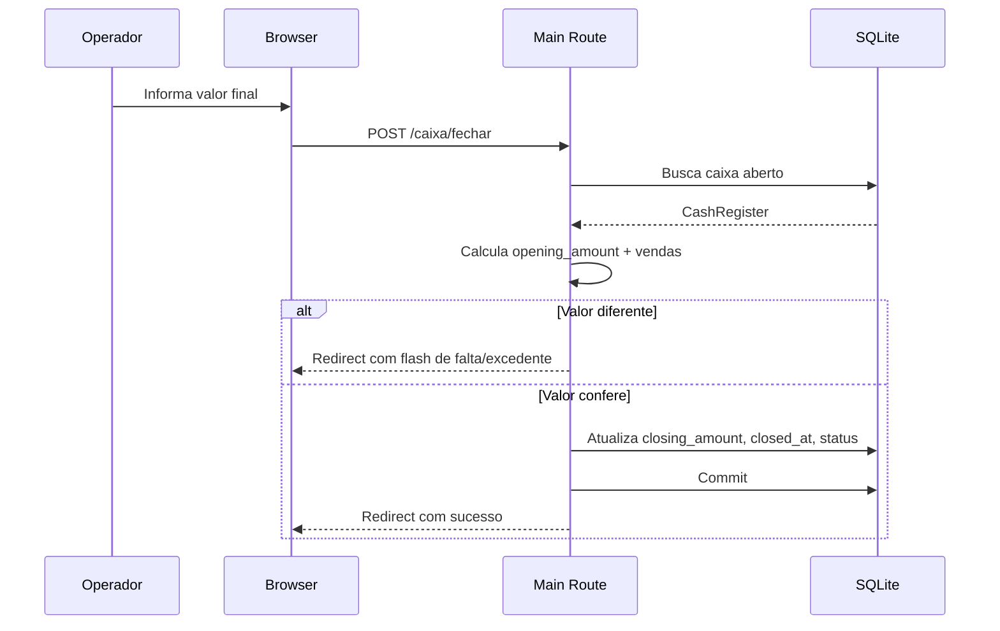
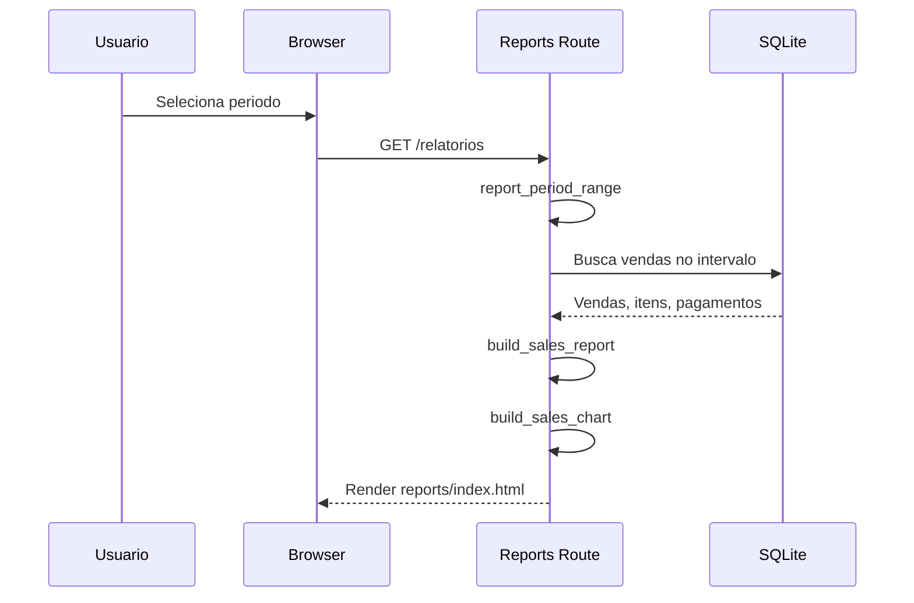
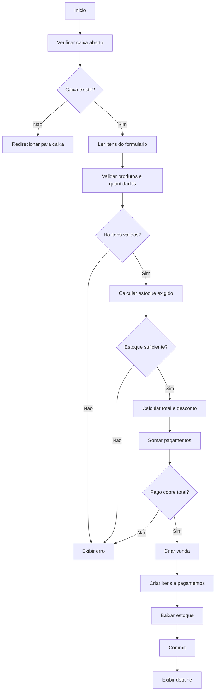

# 20 - Diagramas de Sequência

## Login

```mermaid
sequenceDiagram
    participant U as Usuario
    participant B as Browser
    participant A as Auth Route
    participant DB as SQLite
    U->>B: Envia usuario e senha
    B->>A: POST /login
    A->>DB: Busca User por username
    DB-->>A: User
    A->>A: check_password
    alt Senha valida
        A->>A: login_user
        A-->>B: Redirect /dashboard
    else Senha invalida
        A-->>B: Render login com flash
    end
```

## Nova Venda

```mermaid
sequenceDiagram
    participant U as Operador
    participant B as Browser
    participant R as Main Route
    participant DB as SQLite
    U->>B: Preenche venda
    B->>R: POST /vendas/nova
    R->>DB: Busca caixa aberto
    DB-->>R: CashRegister
    R->>DB: Busca produtos
    R->>R: Calcula itens e estoque exigido
    R->>DB: Confere estoque
    alt Estoque insuficiente
        R-->>B: Render formulario com erro
    else Estoque suficiente
        R->>R: Calcula desconto, total e pagamento
        alt Pagamento insuficiente
            R-->>B: Render formulario com falta
        else Pagamento suficiente
            R->>DB: Cria Sale
            R->>DB: Cria SaleItem
            R->>DB: Cria Payment
            R->>DB: Baixa estoque
            R->>DB: Commit
            R-->>B: Redirect detalhe da venda
        end
    end
```

## Venda de Kit

```mermaid
sequenceDiagram
    participant R as Main Route
    participant K as Produto Kit
    participant P as Produto Base
    participant DB as SQLite
    R->>K: stock_source_for_product
    K-->>R: kit_component e quantidade por kit
    R->>P: Calcula required_quantity
    R->>DB: Verifica P.stock_quantity
    alt Sem estoque
        R-->>R: Bloqueia venda
    else Com estoque
        R->>P: Decrementa estoque base
        R->>DB: Commit venda
    end
```

## Fechamento de Caixa

```mermaid
sequenceDiagram
    participant U as Operador
    participant B as Browser
    participant R as Main Route
    participant DB as SQLite
    U->>B: Informa valor final
    B->>R: POST /caixa/fechar
    R->>DB: Busca caixa aberto
    DB-->>R: CashRegister
    R->>R: Calcula opening_amount + vendas
    alt Valor diferente
        R-->>B: Redirect com flash de falta/excedente
    else Valor confere
        R->>DB: Atualiza closing_amount, closed_at, status
        R->>DB: Commit
        R-->>B: Redirect com sucesso
    end
```

## Relatórios

```mermaid
sequenceDiagram
    participant U as Usuario
    participant B as Browser
    participant R as Reports Route
    participant DB as SQLite
    U->>B: Seleciona periodo
    B->>R: GET /relatorios
    R->>R: report_period_range
    R->>DB: Busca vendas no intervalo
    DB-->>R: Vendas, itens, pagamentos
    R->>R: build_sales_report
    R->>R: build_sales_chart
    R-->>B: Render reports/index.html
```

## Diagrama de Atividades - Venda

```mermaid
flowchart TD
    A["Inicio"] --> B["Verificar caixa aberto"]
    B --> C{"Caixa existe?"}
    C -- "Nao" --> D["Redirecionar para caixa"]
    C -- "Sim" --> E["Ler itens do formulario"]
    E --> F["Validar produtos e quantidades"]
    F --> G{"Ha itens validos?"}
    G -- "Nao" --> H["Exibir erro"]
    G -- "Sim" --> I["Calcular estoque exigido"]
    I --> J{"Estoque suficiente?"}
    J -- "Nao" --> H
    J -- "Sim" --> K["Calcular total e desconto"]
    K --> L["Somar pagamentos"]
    L --> M{"Pago cobre total?"}
    M -- "Nao" --> H
    M -- "Sim" --> N["Criar venda"]
    N --> O["Criar itens e pagamentos"]
    O --> P["Baixar estoque"]
    P --> Q["Commit"]
    Q --> R["Exibir detalhe"]
```
