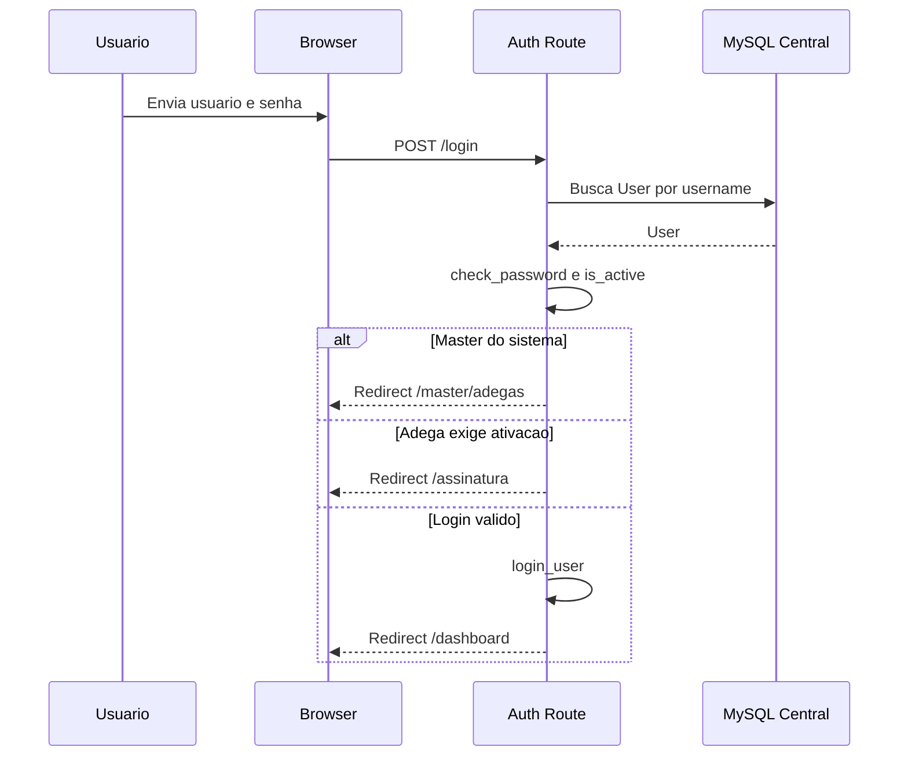
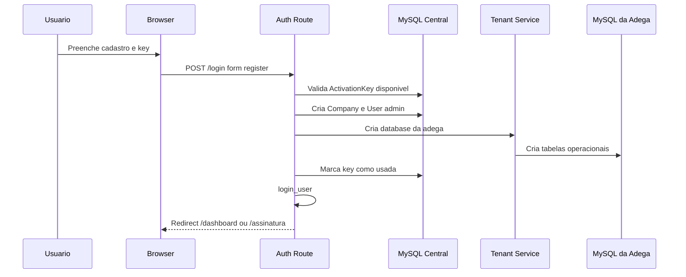
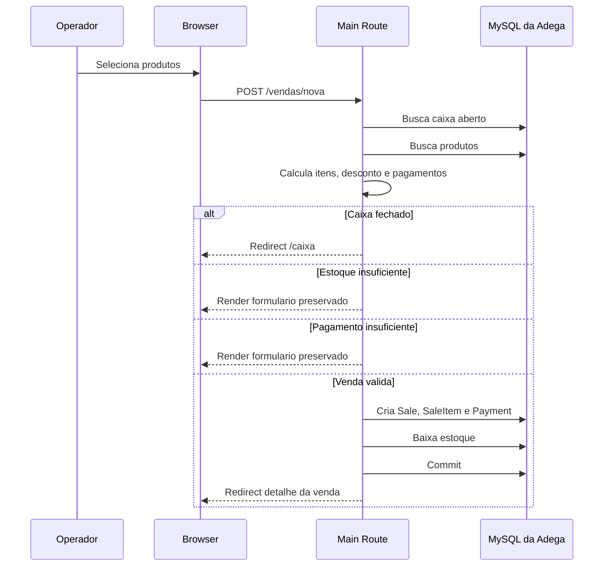
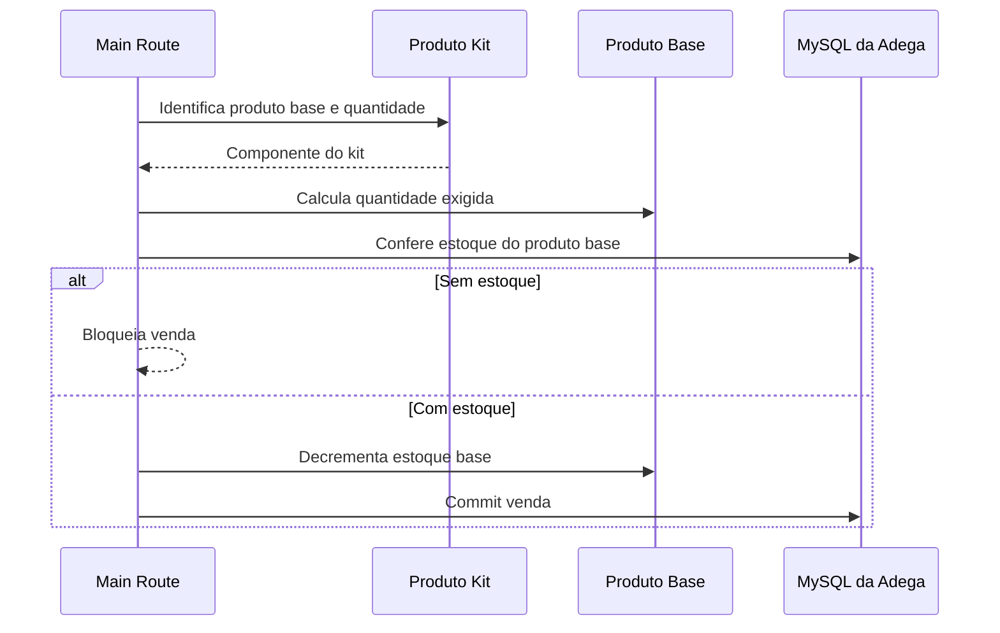
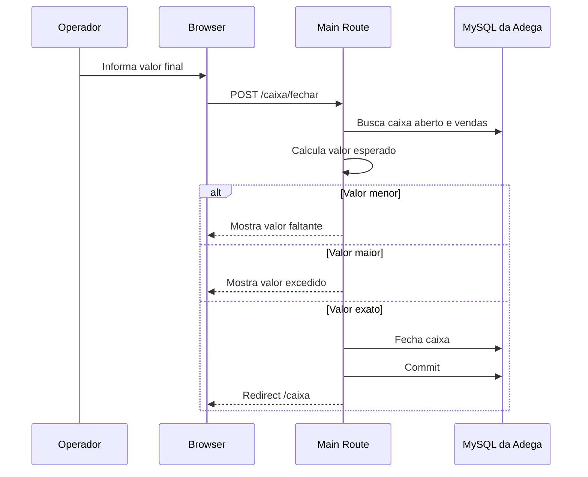
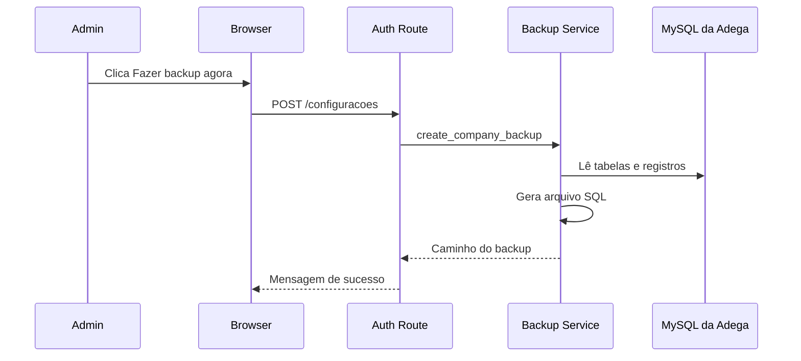

# 20 - Diagramas de Sequência

## Login

```mermaid
sequenceDiagram
    participant U as Usuario
    participant B as Browser
    participant A as Auth Route
    participant C as MySQL Central
    U->>B: Envia usuario e senha
    B->>A: POST /login
    A->>C: Busca User por username
    C-->>A: User
    A->>A: check_password e is_active
    alt Master do sistema
        A-->>B: Redirect /master/adegas
    else Adega exige ativacao
        A-->>B: Redirect /assinatura
    else Login valido
        A->>A: login_user
        A-->>B: Redirect /dashboard
    end
```

## Cadastro com Key

```mermaid
sequenceDiagram
    participant U as Usuario
    participant B as Browser
    participant A as Auth Route
    participant C as MySQL Central
    participant T as Tenant Service
    participant D as MySQL da Adega
    U->>B: Preenche cadastro e key
    B->>A: POST /login form register
    A->>C: Valida ActivationKey disponivel
    A->>C: Cria Company e User admin
    A->>T: Cria database da adega
    T->>D: Cria tabelas operacionais
    A->>C: Marca key como usada
    A->>A: login_user
    A-->>B: Redirect /dashboard ou /assinatura
```

## Nova Venda

```mermaid
sequenceDiagram
    participant U as Operador
    participant B as Browser
    participant R as Main Route
    participant D as MySQL da Adega
    U->>B: Seleciona produtos
    B->>R: POST /vendas/nova
    R->>D: Busca caixa aberto
    R->>D: Busca produtos
    R->>R: Calcula itens, desconto e pagamentos
    alt Caixa fechado
        R-->>B: Redirect /caixa
    else Estoque insuficiente
        R-->>B: Render formulario preservado
    else Pagamento insuficiente
        R-->>B: Render formulario preservado
    else Venda valida
        R->>D: Cria Sale, SaleItem e Payment
        R->>D: Baixa estoque
        R->>D: Commit
        R-->>B: Redirect detalhe da venda
    end
```

## Venda de Kit

```mermaid
sequenceDiagram
    participant R as Main Route
    participant K as Produto Kit
    participant P as Produto Base
    participant D as MySQL da Adega
    R->>K: Identifica produto base e quantidade
    K-->>R: Componente do kit
    R->>P: Calcula quantidade exigida
    R->>D: Confere estoque do produto base
    alt Sem estoque
        R-->>R: Bloqueia venda
    else Com estoque
        R->>P: Decrementa estoque base
        R->>D: Commit venda
    end
```

## Fechamento de Caixa

```mermaid
sequenceDiagram
    participant U as Operador
    participant B as Browser
    participant R as Main Route
    participant D as MySQL da Adega
    U->>B: Informa valor final
    B->>R: POST /caixa/fechar
    R->>D: Busca caixa aberto e vendas
    R->>R: Calcula valor esperado
    alt Valor menor
        R-->>B: Mostra valor faltante
    else Valor maior
        R-->>B: Mostra valor excedido
    else Valor exato
        R->>D: Fecha caixa
        R->>D: Commit
        R-->>B: Redirect /caixa
    end
```

## Backup Manual

```mermaid
sequenceDiagram
    participant A as Admin
    participant B as Browser
    participant R as Auth Route
    participant BK as Backup Service
    participant D as MySQL da Adega
    A->>B: Clica Fazer backup agora
    B->>R: POST /configuracoes
    R->>BK: create_company_backup
    BK->>D: Lê tabelas e registros
    BK->>BK: Gera arquivo SQL
    BK-->>R: Caminho do backup
    R-->>B: Mensagem de sucesso
```
